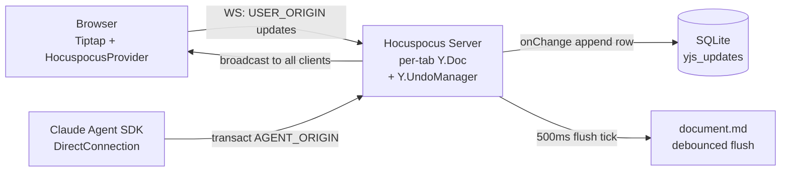
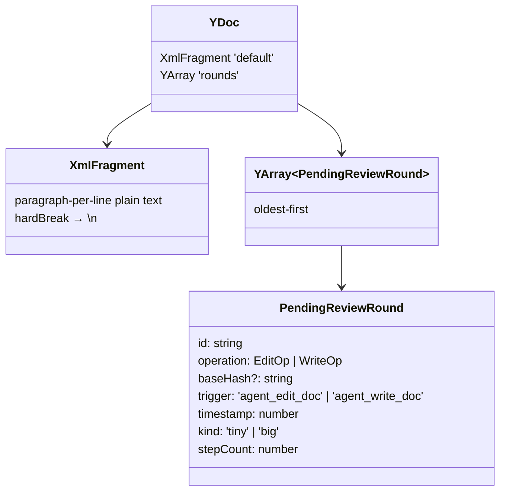
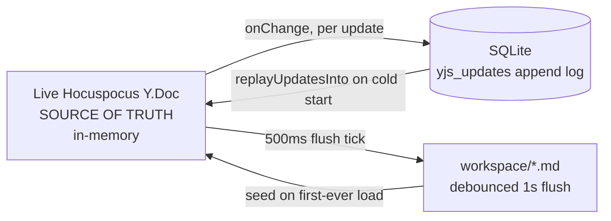
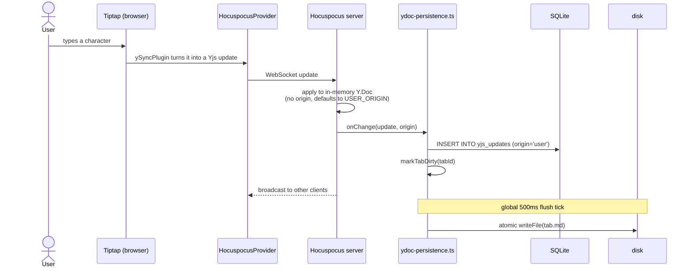
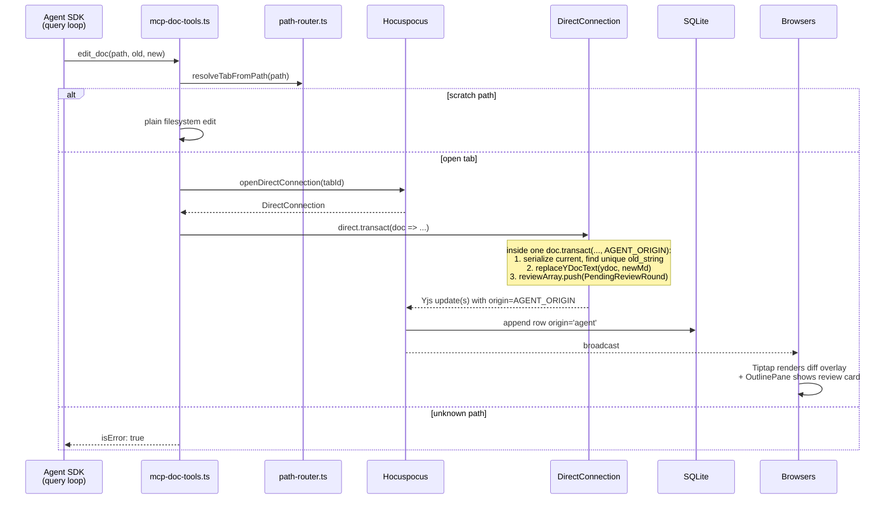
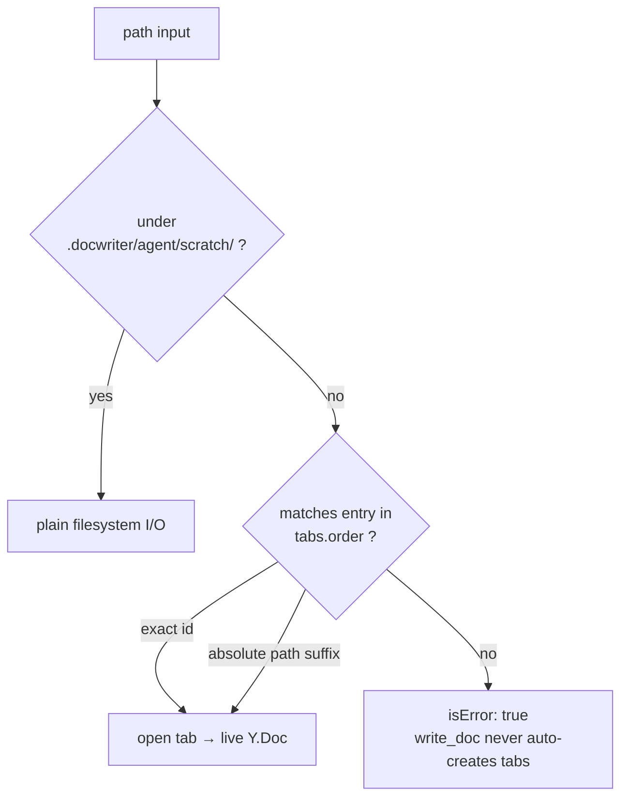
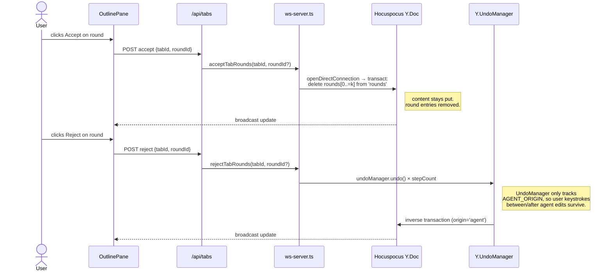
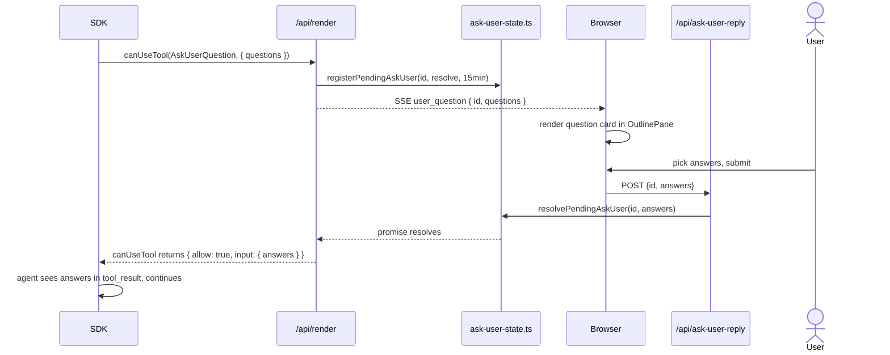
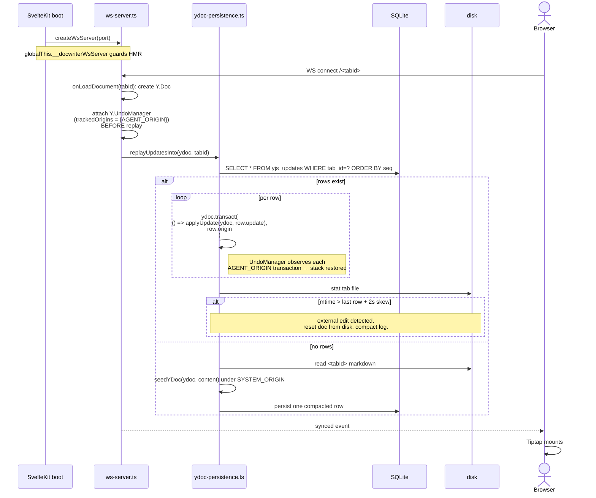

# DocWriter Architecture

A local markdown writing editor with an AI side-channel. The user types
in a Tiptap editor; an agent proposes edits by mutating the same live
Y.Doc the editor is bound to; every change — human or agent — flows
through a single origin-tagged CRDT log on the server.

This doc is written for a new team member. It starts with the one big
idea, walks the three main data flows with diagrams, and then gets into
per-module detail.

---

## The one big idea

**Hocuspocus owns each tab's Y.Doc on the server. Everything is just a
Yjs transaction with an origin tag.**

- The browser is a synced client, not an owner. It binds Tiptap to a
  `HocuspocusProvider` over a WebSocket.
- The agent is another client. Its MCP tools open a
  `DirectConnection` to the same Hocuspocus document and `transact(...,
  AGENT_ORIGIN)`.
- User keystrokes land as `USER_ORIGIN` transactions. Cold-start seeds
  land as `SYSTEM_ORIGIN`.
- Every transaction is appended to SQLite's `yjs_updates` table with
  its origin string, and broadcast to every other connected client.
- Review, undo, reject, and "what did the agent just do" all fall out
  of origin tagging on one authoritative doc. There are no shadow
  files, no 3-way merge, no client-side IndexedDB.



---

## Repo map

```
docwriter/
├─ bin/
│  ├─ docwriter.js           ← packaged CLI launcher
│  └─ docwriter-dev.js       ← Vite dev launcher
├─ src/
│  ├─ app.html               ← HTML shell + fonts (Lora, Inter, Geist Mono)
│  ├─ hooks.server.ts        ← SvelteKit boot: start Hocuspocus, install skills
│  ├─ routes/
│  │  ├─ +layout.svelte
│  │  ├─ +page.svelte        ← the whole app shell
│  │  └─ api/                ← SvelteKit endpoints (see "API surface")
│  │     ├─ render/          ← SSE agent loop (≈1000 lines, the core)
│  │     ├─ tabs/ document/ files/ file-content/
│  │     ├─ history/ session/ hooks/ references/
│  │     ├─ live/ ask-user-reply/
│  └─ lib/
│     ├─ shared/
│     │  └─ ydoc-codec.ts    ← single source of truth for Y.Doc shape
│     ├─ server/             ← anything that touches disk, DB, or Hocuspocus
│     ├─ components/         ← Svelte 5 components (runes)
│     ├─ editor/
│     │  ├─ TiptapEditor.svelte   ← editor surface, feedback UI, idle timer
│     │  └─ diff-overlay.ts       ← visual diff for pending review rounds
│     ├─ yjs-doc.ts          ← per-tab client Y.Doc + HocuspocusProvider
│     ├─ stores.ts           ← Svelte stores (UI projections)
│     ├─ types.ts            ← shared types
│     ├─ review-rounds.ts    ← materialize pending rounds, apply operations
│     ├─ review-diff.ts      ← classify 'tiny' vs 'big'
│     ├─ diff.ts             ← unified line diff
│     ├─ editor-extensions.ts
│     └─ themes.ts
├─ ARCHITECTURE.md           ← (this file)
├─ CLAUDE.md                 ← guidance for Claude Code working on DocWriter
├─ README.md / RELEASE.md
└─ package.json
```

`.docwriter/` (created inside the user's workspace, not the repo) holds
runtime state:

```
<workspace>/
├─ <user's markdown files>
└─ .docwriter/
   ├─ docwriter.db           ← SQLite (authoritative for Y.Doc + settings)
   ├─ hooks.json             ← user-defined shell hooks
   ├─ references.json        ← writing-style references index
   ├─ references/            ← stored sample files
   └─ agent/scratch/         ← agent's private workspace (lazy-created)
```

---

## Runtime topology

```mermaid
flowchart TB
  subgraph CLI
    A1[bin/docwriter.js<br/>picks port, sets DOCWRITER_ROOT]
  end

  subgraph Node["Node process (one)"]
    SK[SvelteKit server<br/>port = PORT]
    WS[Hocuspocus WS server<br/>port = DOCWRITER_WS_PORT]
    SK -. hooks.server.ts starts WS .-> WS
  end

  subgraph Browser
    PG[/+page.svelte shell/]
    ED[TiptapEditor<br/>HocuspocusProvider]
    HIST[HistoryPane<br/>SSE subscriber]
    PG --> ED
    PG --> HIST
  end

  subgraph Agent["Claude Agent SDK (spawned per render)"]
    Q[query loop]
    MCP1[docwriter MCP<br/>propose_rule, propose_hook]
    MCP2[docwriter-doc MCP<br/>edit_doc, read_doc, write_doc]
  end

  A1 --> SK
  ED <-- WebSocket Yjs sync --> WS
  HIST <-- SSE /api/render --> SK
  SK -- spawns --> Q
  Q --> MCP1
  Q --> MCP2
  MCP2 <-- DirectConnection --> WS
```

The SvelteKit HTTP server and Hocuspocus WS server live in the same
Node process but on different ports. `src/hooks.server.ts` boots
Hocuspocus once, guarded by a `globalThis.__docwriterWsServer`
singleton so Vite HMR doesn't try to double-bind the port.

---

## The Y.Doc schema (one per tab)

Every tab has one `Y.Doc` with exactly two shared types. Defined once
in `src/lib/shared/ydoc-codec.ts` and used by both server and client.



Content and review metadata sit inside the same Y.Doc, so a single
`transact(..., AGENT_ORIGIN)` can atomically update both and the
browser sees the change + review card in one frame.

Constants (all exported from `shared/ydoc-codec.ts`):

| Name | Value |
| --- | --- |
| `FRAGMENT_NAME` | `'default'` |
| `REVIEW_ARRAY_NAME` | `'rounds'` |
| `AGENT_ORIGIN` | `'agent'` |
| `USER_ORIGIN` | `'user'` |
| `SYSTEM_ORIGIN` | `'system'` |

Any drift between server and client on these strings breaks the
UndoManager (which matches origin by string equality).

---

## Persistence

Three layers, one source of truth.



1. **Live Y.Doc** (in-memory, in Hocuspocus) — authoritative while the
   process is alive.
2. **`.docwriter/docwriter.db`** — durable. Every Yjs update is one
   row with its origin tag. Server restart replays this log.
3. **`<tab>.md`** — plain markdown on disk. Debounced backup for git
   and portability, not the source of truth. External edits to this
   file are detected by mtime and fold into the Y.Doc on cold start.

### SQLite schema

Defined in `src/lib/server/db-schema.ts`:

```sql
CREATE TABLE yjs_updates (
  tab_id   TEXT NOT NULL,
  seq      INTEGER PRIMARY KEY AUTOINCREMENT,
  "update" BLOB NOT NULL,           -- reserved word; MUST be quoted
  origin   TEXT NOT NULL,           -- 'agent' | 'user' | 'system'
  created  INTEGER NOT NULL
);
CREATE INDEX yjs_updates_tab_id ON yjs_updates(tab_id);

CREATE TABLE tabs (tab_id PK, order_index, is_active);
CREATE TABLE rules (id PK, text, created_at);
CREATE TABLE hooks (id PK, event, matcher, command, enabled);
CREATE TABLE recent_actions (label, used_at);
CREATE TABLE action_usage_counts (action PK, count);
CREATE TABLE kv (key PK, value);
```

KV keys in use: `sessionId`, `agentSettings` (JSON), `editorSoftWrap`,
`last_seen:<tabId>` (markdown snapshot for next-render diff).

> **Gotcha:** `update` is a SQLite reserved word. Every read/write on
> that column must quote it as `"update"`. Some builds silently ignore
> the missing quotes, others corrupt.

---

## Flow 1 — User keystroke



Key files: `src/lib/server/ws-server.ts` (onChange plumbing),
`src/lib/server/ydoc-persistence.ts` (append + flush loop).

The browser's editor update handler serializes the content to the
`userMd` store for the outline, and restarts the 3-second idle timer
(`IDLE_MS = 3000`) — typing pauses trigger auto-submit unless the
update's origin was `AGENT_ORIGIN`.

---

## Flow 2 — Agent edit

The most important flow. An agent tool call must land the content
change and the review card atomically.



Three tools, all in `src/lib/server/mcp-doc-tools.ts`:

| Tool | Purpose | Fails when |
| --- | --- | --- |
| `read_doc(path)` | Serialize the **live** Y.Doc (so the agent sees what the user sees now). For open tabs with pending rounds it reads the latest proposed text. | Unknown path. |
| `edit_doc(path, old_string, new_string)` | Replace exactly one occurrence of `old_string`. | 0 hits or >1 hits (agent must call `read_doc` and retry with more context). |
| `write_doc(path, content)` | Replace the entire doc. Records a `baseHash` so if the user edits between proposal and accept, the round is marked stale. | Unknown path. Does NOT create new tabs. |

Why custom tools instead of the SDK's built-in `Edit`/`Write`? Because
the built-ins operate on files on disk, bypassing the live Y.Doc.
DocWriter's authority is the live doc; tools must edit what the browser
is currently showing, not the debounced-backup file.

`canUseTool` in `/api/render` explicitly denies built-in `Read`, `Glob`,
`Grep`, `Bash` on open-tab paths — the agent must use `read_doc` to see
current live content.

### Path routing



See `src/lib/server/path-router.ts`.

---

## Flow 3 — Review accept / reject

Review rounds live inside `Y.Array('rounds')` on the Y.Doc, so
accept/reject is just a Yjs mutation that propagates to every client.



The `Y.UndoManager` lives on the server, attached to each Y.Doc in
`src/lib/server/ws-server.ts` with `trackedOrigins: new Set([AGENT_ORIGIN])`
and `captureTimeout: 0` (so each tool call is one undo step).

> **Gotcha — construction order.** The UndoManager must be attached
> **before** `replayUpdatesInto(...)` runs. Otherwise, after a server
> restart, Reject on a round from a prior session becomes a no-op
> because the undo stack is empty. See `ws-server.ts` for the guarded
> order.

### Staleness

A write-round records `baseHash` (`reviewTextHash`). If the user edits
the doc before accepting that round, the stored hash no longer matches
the current content, and the round is marked `stale` in
`materializePendingReviewRounds` (`src/lib/review-rounds.ts`). The UI
disables Accept on stale rounds and shows why.

For edit-rounds, staleness is simpler: if `old_string` no longer
appears exactly once in the current text, the round is stale.

---

## Flow 4 — The agent render loop

`/api/render` is an SSE endpoint. One POST = one invocation of the
Claude Agent SDK's `query()`; the response stream drives the
HistoryPane.

```mermaid
sequenceDiagram
  participant Br as Browser
  participant R as /api/render
  participant SDK as Agent SDK
  participant MCP2 as docwriter-doc MCP
  participant H as Hocuspocus
  participant DB as SQLite

  Br->>R: POST {userMessage?, model?, warmup?, planMode?}
  R->>R: buildSystemPrompt() (cached)
  R->>R: buildMultiTabPrompt(activeTab, tabs, userMessage)
  Note right of R: active tab: full content + diff vs last_seen<br/>other tabs: path or path+diff<br/>+ rules + agency + style refs
  R->>SDK: query({ prompt, mcpServers, hooks, canUseTool })
  loop streaming events
    SDK-->>R: system / tool_call_start / tool_use / assistant_text / thinking / result
    R-->>Br: SSE event
    alt edit_doc / write_doc / read_doc
      SDK->>MCP2: tool call
      MCP2->>H: DirectConnection.transact(AGENT_ORIGIN)
      H-->>Br: Yjs update via WebSocket<br/>(parallel to SSE)
    else ExitPlanMode
      R-->>Br: plan_proposed; abort
    else AskUserQuestion
      R->>R: registerPendingAskUser(id, resolve, 15min)
      R-->>Br: user_question event
      Br->>R: POST /api/ask-user-reply {id, answers}
      R-->>SDK: resolve promise → agent continues
    else propose_rule / propose_hook
      R-->>Br: rule_proposal / hook_proposal
    end
  end
  R->>DB: kv['last_seen:<tabId>'] = current markdown (per tab)
  R-->>Br: result + done
```

The render event stream:

- **Content** arrives over the WebSocket, not the SSE stream. The SSE
  `result` event no longer carries markdown; the browser already has it.
- **Agent narration** (tool calls, thinking summaries, status) arrives
  over SSE and feeds the HistoryPane.

### Prompt construction

`buildMultiTabPrompt()` in `src/routes/api/render/+server.ts` inlines:

- Active tab: full content + unified-line diff vs `kv['last_seen:<tabId>']`.
- Non-active tab with changes: path + diff (agent calls `read_doc` if
  it needs more).
- Non-active tab unchanged: path only.
- First render for a tab (no `last_seen`): full content.
- Persistent writing rules.
- Agency guidance: one of three blocks based on
  `agentSettings.agency` (`conservative | balanced | aggressive`).
- Style references block (see `server/references.ts`).

After render, `last_seen:<tabId>` is refreshed to the current markdown
for every tab the agent saw, so the next render diffs against what the
agent knew last time.

### Plan mode

If `planMode: true`, `canUseTool` blocks all mutation tools (edit_doc,
write_doc, Edit, Write, Bash, filesystem writes) but allows
read/search. The SDK's `ExitPlanMode` tool call emits a
`plan_proposed` SSE event and aborts the stream; the user either
approves (then we re-run without plan mode) or rejects.

### Warmup mode

`warmup: true` does the same but even narrower — only read/search and
`WebSearch`/`WebFetch` are allowed. Used to pre-populate context
without any risk of side effects.

---

## Flow 5 — AskUserQuestion



The parking state is in-process memory (`src/lib/server/ask-user-state.ts`).
If the process dies, pending questions time out and the render aborts.

---

## Flow 6 — Cold start and server restart



### Compaction

`yjs_updates` grows one row per update. `compactTab(tabId)` in
`ydoc-persistence.ts` merges all rows for a tab into a single compacted
row with `origin = 'system'`. The helper is in place but not currently
on a hot scheduler.

---

## Client architecture

`src/routes/+page.svelte` is the page shell:

```
┌───────────────┬──────────────────────────────────────────────┐
│ OutlinePane   │ TabBar                                       │
│ (260px, TOC   ├──────────────────────────────────────────────┤
│  from         │                                              │
│  headings)    │          TiptapEditor          AgentDock ──┐ │
│               │     (bound to per-tab Y.Doc    (floating,  │ │
│               │      via HocuspocusProvider)    wake/cost/ │ │
├───────────────┤                                 settings;  │ │
│ FileTree      │   pending edits + comments      expands to │ │
│               │   render in the editor's        HistoryPane│ │
│               │   CommentGutter                 dock)      │ │
└───────────────┴──────────────────────────────────────────────┘
```

There is no fixed right-hand pane. `OutlinePane` is mounted once (left,
TOC only — its old `showReview` mode was removed). The agent event log
(`HistoryPane`) lives inside the expandable floating `AgentDockShell`.
Pending review cards and comment threads render inline in the editor's
`CommentGutter` (with Accept / Reject / Retry) plus per-tab badges on the
`TabBar`; proposed rules / hooks surface as `ToastStack` toasts.

### Per-tab client Y.Doc (`src/lib/yjs-doc.ts`)

A registry of `{ ydoc, wsProvider, readyPromise }` per tab id.

- `getYDocForTab(tabId)` — get or create Y.Doc + HocuspocusProvider.
- `whenYDocReadyForTab(tabId)` — resolves on the provider's first `synced` event.
  Tiptap does not mount until this resolves (no flicker from unhydrated doc).
- There is no module-level "current tab"; the UI `activeTab` store names the
  focused tab and `TiptapEditor` receives that id as an explicit prop.
- `renameTab(oldId, newId)` — snapshot and hand state over.
- `reconcileServerInstance(id)` — the server stamps a UUID on boot.
  If the browser's stored instance id doesn't match, all client Y.Docs
  are reset and providers reconnect fresh — the server may have lost state.

There is **no IndexedDB persistence** on the client. After refresh,
the editor paints only after the WS `synced` event (sub-20ms locally).

### Stores (`src/lib/stores.ts`)

Stores are **projections of the Y.Doc + UI state**, not the source of
editor content.

- Doc projections: `pendingReviewRounds`, `reviewBaseline`,
  `commentThreads`, `openCommentThreadId`.
- Agent output: `proposedRules`, `proposedHooks`, `pendingUserQuestions`,
  `pendingPlanProposals`, `agentHistory`, `isRendering`,
  `submitCountdown`, `sessionCost`.
- Preferences: `selectedProvider`, `selectedModel`, `selectedTheme`,
  `historyVerbosity`, `showFilesPane`, `agentSettings`,
  `editorFontScale`, `editorSoftWrap`.
- Tabs: `tabs`, `activeTab`.
- Actions toolbar (feedback popup): `pinnedActions`, `recentActions`,
  `actionUsageCounts`.

### Components

All in `src/lib/components/`:

| Component | Role |
| --- | --- |
| `TabBar` | Tab strip with open / close / rename / context menu, plus per-tab pending-review/comment badges. |
| `OutlinePane` | Left sidebar, mounted once: auto outline (TOC) from headings. |
| `FileTree` | Workspace file explorer with inline create/rename. |
| `CommentGutter` | In-editor gutter cards for pending agent edits (Accept/Reject/Retry) and comment threads; anchored to document positions. |
| `HistoryPane` | Agent history, tool calls, thinking summaries, cost, notifications. Two modes: `verbose` / `minimal`. Rendered inside `AgentDockShell`. |
| `AgentDock` / `AgentDockShell` | Floating top-right: wake button, sleeping-cat mascot, cost pill, gear-icon settings popover; the shell expands into the agent-history dock. |
| `AgentModal` | Modal for detailed interaction. |
| `AgentSettingsPanel` | Agency level + Track Changes toggle. |
| `ChatPanel` | Direct chat interface. |
| `RulesPanel` / `HooksPanel` / `ReferencesPanel` | CRUD for persistent settings. |
| `Highlighter` | Renders feedback annotations over selected ranges. |
| `MenuBar` | Top menu. |
| `PanelResizer` / `HorizontalPanelResizer` | Draggable dividers. |
| `ShineBorder` | Decorative animated border. |

### Editor update loop (`src/lib/editor/TiptapEditor.svelte`)

On every ProseMirror transaction:

1. If it carries `ySyncPluginKey` meta, Yjs is pushing a remote update
   into the editor (another client or the agent) — skip the idle-timer
   restart; an agent edit is not "the user is still writing".
   (`ySyncPluginKey` must be imported from `@tiptap/y-tiptap` via
   `editor-extensions.ts` — the `y-prosemirror` key is a different
   instance and never matches.)
2. Otherwise (doc changed, no sync meta ⇒ local typing), restart the
   3-second idle-submit countdown.

Cmd/Ctrl+Enter skips the countdown. The client does not `PUT
/api/document` with markdown; the server's Y.Doc-to-disk flush owns that.

---

## API surface

All under `src/routes/api/`:

| Endpoint | Purpose |
| --- | --- |
| `render/` | **SSE stream.** POST kicks off one Agent SDK `query()`. Returns tool events, thinking, proposals, status. The main agent loop. |
| `tabs/` | GET order/active/tabs. POST opens/creates. PATCH focuses or renames. DELETE closes, optionally deletes file. Also hosts accept/reject review endpoints. |
| `document/` | GET reads workspace file + metadata (calls `flushTabMarkdownNow` first). PUT accepts only `meta` (rules / agent settings). No accept/reject here anymore — those are Y.Map mutations. |
| `files/` | Workspace file tree: list / create / rename / move / delete. |
| `file-content/` | Raw read/write for non-editor files. |
| `history/` | Rehydrate agent event timeline from SDK transcript. |
| `session/` | GET session id + recent actions + usage counts. DELETE clears session-scoped state (New session). |
| `hooks/` | Read / replace persisted hook configuration. |
| `references/` | GET style references index. POST add workspace-file / URL / stored-sample. `[id]` DELETE. |
| `live/` | File-watch notifications so external edits (`--watch`) reach the browser. |
| `ask-user-reply/` | POST `{ id, answers }` resolves a pending `AskUserQuestion` in `/api/render`. |

---

## Agent settings & rules

Persisted state lives in SQLite, dual-mirrored to JSON where useful for
portability.

| Setting | Type | Stored in | Prompt effect |
| --- | --- | --- | --- |
| `rules[]` | `{ id, text }[]` | `rules` table | Inlined in system prompt on every render. |
| `agentSettings.agency` | `'conservative' \| 'balanced' \| 'aggressive'` | `kv['agentSettings']` (JSON) | Picks one of three agency-guidance blocks. |
| `agentSettings.trackChanges` | boolean | same | When off, edits still flow through `AGENT_ORIGIN` but the review-card UI is skipped. |
| `hooks[]` | `Hook[]` | `hooks` table + `.docwriter/hooks.json` | Executed as shell commands around agent tool calls — see `hooks-config.ts`. |
| `editorSoftWrap` | boolean | `kv['editorSoftWrap']` | Editor display. |
| `sessionId` | string | `kv['sessionId']` | Resume parameter for SDK query(). |

Agent settings are edited via the `AgentDock` gear-icon popover.

---

## Agent scratch workspace

The agent has a private filesystem workspace at
`.docwriter/agent/scratch/`. `edit_doc` / `write_doc` / `read_doc`
transparently route to plain filesystem I/O when the path is under
that directory, so the agent can keep research notes, drafts, and
outlines without them appearing as user tabs. The directory is
lazy-created on first scratch write, and cleared on "New session".

Built-in `Edit` / `Write` / `Read` / `Glob` / `Grep` also still work
for files outside the open-tab set.

---

## Workspace safety

`src/lib/server/workspace-path.ts` enforces that all file operations
stay inside `DOCWRITER_ROOT`. It resolves through the nearest existing
real ancestor (so `..` traversal and symlink escapes are blocked even
for not-yet-existing paths). All filesystem routes go through this
resolver.

Hook configuration is never agent-writable. The agent can only call
`propose_hook` via MCP; acceptance flows through the user and `PUT
/api/hooks`.

---

## Key constants (for code-search)

| Constant | Value | Where |
| --- | --- | --- |
| `AGENT_ORIGIN` | `'agent'` | `shared/ydoc-codec.ts` |
| `USER_ORIGIN` | `'user'` | `shared/ydoc-codec.ts` |
| `SYSTEM_ORIGIN` | `'system'` | `shared/ydoc-codec.ts` |
| `FRAGMENT_NAME` | `'default'` | `shared/ydoc-codec.ts` |
| `REVIEW_ARRAY_NAME` | `'rounds'` | `shared/ydoc-codec.ts` |
| `DOCWRITER_WS_PORT` | 3001 (default) | `hooks.server.ts` |
| `FLUSH_TICK_MS` | 500 | `server/ydoc-persistence.ts` |
| `EXTERNAL_EDIT_SKEW_MS` | 2000 | `server/ydoc-persistence.ts` |
| `IDLE_MS` | 3000 | `editor/TiptapEditor.svelte` |
| `TINY_EDIT_THRESHOLD` | 25 | `types.ts` |
| `USER_HOOK_TIMEOUT_SEC` | 60 | `routes/api/render/+server.ts` |

---

## Gotchas (from painful debugging sessions)

- **Yjs origins are shared constants.** `AGENT_ORIGIN` / `USER_ORIGIN` /
  `SYSTEM_ORIGIN` live once in `src/lib/shared/ydoc-codec.ts` and are
  imported by both client and server. Never redefine them locally — the
  origin string in the SQLite log and the client's `trackedOrigins`
  matching both depend on the exact values.
- **`ySyncPluginKey` must come from `@tiptap/y-tiptap`.** The
  Collaboration extension installs its sync plugin from
  `@tiptap/y-tiptap`; `y-prosemirror` exports a *different*
  `PluginKey('y-sync')` instance that never matches. Import the key and
  the rel-position helpers from `editor-extensions.ts` (the single
  source) — the wrong import silently breaks agent-vs-user transaction
  classification and RelativePosition comment anchoring.
- **Hocuspocus's internal Document is authoritative.** Once a client
  has connected and `onLoadDocument` has run, Hocuspocus's own
  `Document` is the source of truth. Server code that wants to mutate
  a tab MUST go through `server.hocuspocus.openDirectConnection(tabId)`
  — not a cached Y.Doc reference.
- **`"update"` is a SQLite reserved word.** Always quote the column.
- **Serialization is plain text, not markdown.** `serializeFragment` /
  `serializeYDoc` emit document text verbatim (plus typography
  normalization); nothing escapes markdown specials. The schema is
  intentionally minimal (Document / Paragraph / Text / HardBreak) —
  don't add StarterKit, Link, or Tiptap's history extension; undo is
  the custom `Y.UndoManager` wired via
  `Collaboration.configure({ yUndoOptions })`.
- **Vite HMR re-executes `hooks.server.ts`.** The
  `globalThis.__docwriterWsServer` guard keeps us from double-binding
  the WS port on every save.

---

## Design principles

1. **User edits must not be lost.** Per-tab Y.Docs, `AGENT_ORIGIN`
   isolation for undo, CRDT item-level merge for concurrent writes.
2. **Agent work must remain reviewable.** Every `edit_doc` /
   `write_doc` atomically pairs its content change with a
   `PendingReviewRound` entry.
3. **The app works against a real folder, not a sandbox.**
   Workspace-relative tab ids, filesystem-backed APIs, file tree + raw
   file endpoints, CLI root selection.
4. **Single source of truth.** The live Hocuspocus Y.Doc owns editor
   content; SQLite owns the Yjs update log; markdown on disk is a
   debounced backup. No IndexedDB, no shadow files, no 3-way merge.
5. **Origin tagging over explicit reconciliation.** All mutation flows
   through Yjs with an origin string. Review, undo, history all drop
   out of that log.

---

## Bottom line

DocWriter is a local multi-file writing environment where:

- each tab is a server-owned CRDT synced to the browser over WebSocket,
- every Yjs update is appended to a SQLite log tagged with its origin,
- a Claude Agent SDK loop edits the live Y.Doc through custom MCP tools
  (atomic content + review card, no shadows, no merge),
- review queue entries are just items in a `Y.Array` inside the same doc,
- markdown on disk is a debounced backup for git and portability.

Content convergence is the CRDT's job. Everything else — review, undo,
reject, history — is a consequence of origin-tagged transactions on a
single authoritative doc.
