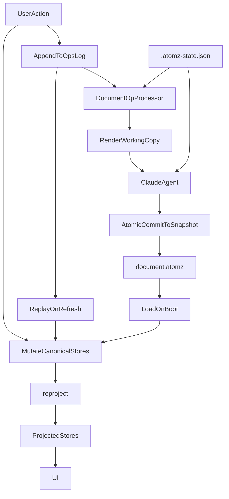

# atomz Architecture

This document describes the current runtime and persistence architecture of `atomz`, with a focus on the document sync model, Claude render flow, and crash/refresh recovery.

## Overview

`atomz` is a writing editor built around a structured document model:

- `atoms`: the source claims and hierarchy
- `blocks`: the ordered document body (`heading` and `markdown` blocks)
- `pins`: durable cross-links between atoms and prose blocks
- `rules`: writing constraints

The canonical on-disk format is block-based. The app derives readonly Svelte stores (`prose`, `sections`, `paraBreaks`, `editorPins`) as runtime projections for the UI, but all mutations flow through the canonical stores.

## Main Files

### Canonical snapshot

- `document.atomz`

This is the committed document snapshot. The canonical `.atomz` schema is:

- `version`
- `atoms`
- `rules`
- `blocks`
- `pins`

Block kinds: `heading`, `markdown`. Markdown blocks can contain normal markdown content, including images, lists, emphasis, and other markdown constructs.

### Runtime/session state

- `.atomz-state.json`

This stores non-document runtime metadata such as the current Claude `sessionId`.

### Append-only durable ops log

- `.atomz-ops.jsonl`

This is the durable append-only log used to preserve unresolved work across refreshes and crashes. It stores semantic `DocumentOp` events representing replayable user intent and reconciliation requests.

### Render working copy

- `.atomz-render.json`

This is the temporary file Claude edits during `/api/render`. The canonical snapshot is only updated after the server validates and merges the result.

### Prose history

- `.atomz-history.json`

This stores prose-oriented history used by the versions UI.

## High-Level Model

## Client Architecture

### Canonical stores (source of truth, writable)

- `blocks` — `AtomzBlock[]` (heading blocks + markdown blocks with atomIds)
- `pins` — `AtomzPin[]` (verbatim pins with atom/block anchors)
- `fragments` — `Fragment[]` (atoms — subject/predicate, `pinnedWords` derived from pins via `reproject()`)
- `rules` — `Rule[]`

### Projected stores (readonly, derived via `reproject()`)

- `prose` — `Sentence[]` derived from blocks
- `sections` — `Section[]` derived from heading blocks
- `paraBreaks` — `Set<number>` derived from markdown block boundaries
- `editorPins` — `EditorPin[]` derived from blocks + pins

No component ever directly mutates the projected stores. They are updated exclusively through:
- `reproject()` — reads canonical stores, builds AtomzFileV2, projects to runtime state, calls `setProjectedRuntimeView()`
- `applyCanonicalFileToStores(file)` — loads a full AtomzFileV2 into all stores

### Mutation pattern

All user actions follow the same pattern:

1. Mutate canonical stores directly (`blocks.set()`, `pins.set()`, `fragments.update()`)
2. Call `reproject()` to update projected stores
3. Push a `DocumentOp` for durable intent tracking

### Document ops

Current replayable op types:

- `edit_atom` — atom subject/predicate changed, requires agent reconciliation
- `replace_fragments` — atom structure changed, requires agent reconciliation
- `pin_atom_word` — pin toggled on atom, may require agent if pin text missing from linked prose
- `pin_prose_text` — pin created from prose selection, may require agent if text missing from linked atoms
- `update_blocks` — blocks changed directly (editor edits, section renames, paragraph breaks), no agent needed
- `update_pins` — pins changed directly, no agent needed
- `replace_rules` — rules changed, no agent needed
- `feedback_request` — user annotation/feedback, requires agent reconciliation

### Document-op processing

The background processor derives two outcomes from unresolved ops:

- `localOnlyOps`: can be resolved after saving the canonical snapshot
- `agentOps`: require Claude reconciliation through `/api/render`

### Undo

Block-level snapshots via `blockHistory` store. `pushBlockSnapshot()` captures current blocks + pins before agent edits. `undoBlocks()` restores the snapshot and calls `reproject()`.

## Server Architecture

### `/api/document`

Reads and writes `document.atomz`. This is the canonical snapshot endpoint.

### `/api/history`

Loads Claude conversation history using the `sessionId` from `.atomz-state.json`.

### `/api/document-ops`

Durable semantic document-op API backed by `.atomz-ops.jsonl`.

### `/api/render`

This is the Claude render path.

Current behavior:

1. Normalize the current canonical file into `.atomz v2`
2. Project `atoms + rules + blocks + pins` into a Claude-friendly render document with `atoms`, `rules`, `prose`
3. Strip heading entries out of projected `prose` before Claude sees the file
4. Write the render document to `.atomz-render.json`
5. Run Claude against the render working copy
6. Read the edited working copy back
7. Reinsert heading entries into the projected prose
8. Merge the updated render document back into canonical `blocks`
9. Atomically commit the merged `.atomz v2` document into `document.atomz`

Important invariant: Claude edits `.atomz-render.json`, only the server commit step writes `document.atomz`.

## Refresh / Recovery Flow

On boot, the client does:

1. Load `document.atomz`
2. Call `applyCanonicalFileToStores()` which hydrates all canonical and projected stores
3. Load unresolved semantic document ops from `.atomz-ops.jsonl`
4. Replay them into stores
5. Resume background processing of unresolved ops

## Save / Commit Flow

### Save-to-disk

The client periodically serializes canonical stores into `.atomz v2` format via `buildAtomzFileFromCanonicalState()` and writes through `/api/document`.

Only canonical stores (`fragments`, `rules`, `blocks`, `pins`) trigger save — projected stores do not.

### Render commit

When a render succeeds:

1. Agent-needed `documentOps` that triggered the render are marked resolved
2. The merged render result becomes the new canonical snapshot
3. The live stores are updated from the result via `applyCanonicalFileToStores()`

## Current Timing Model

Timing constants are centralized in `src/lib/sync-timing.ts`.

Current values:

- `editorIdleMs = 10000` — coalesces direct prose typing before emitting durable block-replacement work
- `queueProcessMs = 1500` — batches unresolved `documentOps` before deciding whether to save locally or run Claude reconciliation
- `saveToDiskMs = 800` — debounces canonical snapshot writes

## Key Source Files

- `src/lib/stores.ts` — store definitions, `setProjectedRuntimeView`
- `src/lib/runtime-canonical.ts` — `reproject()`, `applyCanonicalFileToStores()`, `getCanonicalRuntimeStateFromStores()`
- `src/lib/types.ts` — DocumentOp types, Atom, Sentence, etc.
- `src/lib/atomz.ts` — AtomzFileV2 format, block/pin builders, projection functions
- `src/lib/document-op-utils.ts` — `applyDocumentOp()`
- `src/lib/document-op-processing.ts` — `buildDocumentOpProcessingPlan()`
- `src/lib/sync-timing.ts` — timing constants
- `src/lib/editor/TiptapEditor.svelte` — block-native editor, `syncEditorToBlocks()`
- `src/lib/components/ContentPane.svelte` — atom pane, pin/section/paragraph mutations via blocks/pins
- `src/routes/+page.svelte` — main page, agent render flow, op processing
- `src/lib/server/document-files.ts`
- `src/lib/server/runtime-state.ts`
- `src/routes/api/document/+server.ts`
- `src/routes/api/render/+server.ts`
- `src/routes/api/session/+server.ts`
- `src/routes/api/history/+server.ts`
- `src/routes/api/document-ops/+server.ts`

## Future Directions

- **Binary format**: Replace JSON with MessagePack or CBOR for `.atomz` files. Same schema, ~30-50% smaller, faster parse. Matters as documents grow large.
- **Version snapshots as files**: Store each version as a separate `versions/<timestamp>.atomz` file instead of one big `.atomz-history.json`. Enables cheap listing, diffing, and restoring without loading all versions into memory.
- **Diff-based versions**: Store only deltas between versions. Reduces storage for large documents with many snapshots.
- **Consolidate state files**: Merge `.atomz-state.json` + `.atomz-ops.jsonl` + `.atomz-history.json` into a single state file with `{ sessionId, wal: [...], versionPtrs: [...] }`. Fewer files to manage.
- **Custom file format**: A line-based text format would be more git-diffable than JSON/binary. Trade-off: requires custom parser/serializer.
