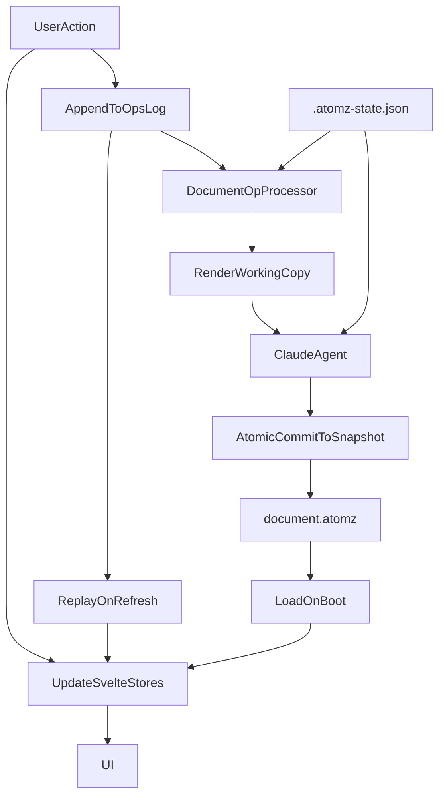

# atomz Architecture

This document describes the current runtime and persistence architecture of `atomz`, with a focus on the document sync model, Claude render flow, and crash/refresh recovery.

## Overview

`atomz` is a writing editor built around a structured document model:

- `atoms`: the source claims and hierarchy
- `blocks`: the ordered document body (`heading` and `markdown` blocks)
- `pins`: durable cross-links between atoms and prose blocks
- `rules`: writing constraints

The canonical on-disk format is block-based and avoids duplicating headings, paragraph structure, and pins across multiple parallel fields. The app still uses derived Svelte stores such as `prose`, `sections`, `paraBreaks`, and `editorPins` as a runtime projection for the current UI.

## Main Files

### Canonical snapshot

- `document.atomz`

This is the committed document snapshot. It should represent the latest durable document state, not transient Claude runtime state.

The current canonical `.atomz` schema is:

- `version`
- `atoms`
- `rules`
- `blocks`
- `pins`

Example block kinds:

- `heading`
- `markdown`

`markdown` blocks can contain normal markdown content, including images, lists, emphasis, and other markdown constructs.

### Runtime/session state

- `.atomz-state.json`

This stores non-document runtime metadata such as the current Claude `sessionId`.

### Append-only durable ops log

- `.atomz-ops.jsonl`

This is the durable append-only log used to preserve unresolved work across refreshes and crashes.

It stores semantic `DocumentOp` events representing replayable user intent and reconciliation requests.

### Render working copy

- `.atomz-render.atomz`

This is the temporary file Claude edits during `/api/render`. The canonical snapshot is only updated after the server validates and merges the result.

### Prose history

- `.atomz-history.json`

This stores prose-oriented history used by the versions UI.

## High-Level Model

## Client Architecture

### Live UI state

The client uses Svelte stores in `src/lib/stores.ts` for the interactive view:

- `blocks`
- `pins`
- `fragments`
- `prose`
- `rules`
- `paraBreaks`
- `editorPins`
- `sections`
- `documentOps`

Stores are not treated as the durable source of truth. They are the in-memory projection that powers the UI.

### Canonical file vs runtime projection

The current UI still works with a derived runtime model:

- `prose`
- `sections`
- `paraBreaks`
- `editorPins`

The runtime now keeps both:

- canonical-ish stores: `blocks`, `pins`
- compatibility stores: `prose`, `sections`, `paraBreaks`, `editorPins`

The compatibility stores are still not persisted directly anymore as first-class fields in the canonical `.atomz` file.

Instead:

- `blocks` project into runtime `prose` and `sections`
- `pins` project into runtime `pinnedWords` on fragments and `editorPins`
- paragraph structure is derived from ordered markdown blocks

This compatibility layer currently lives in `src/lib/atomz.ts`.

`blocks` and `pins` are now also live runtime stores:

- load / restore / render-result paths hydrate them directly
- editor write paths refresh them through shared canonical commit helpers
- atoms-pane structural writes refresh them through the same canonical commit helpers
- save/render requests are assembled from the canonical runtime layer, not just from compatibility stores

The current UI still remains hybrid: many components still think in terms of compatibility stores first, but the canonical runtime layer is now actively maintained during editing instead of only at load/save boundaries.

### Replayable document ops

The client now records a semantic subset of document mutations as `DocumentOp` values.

Current replayable op families:

- `edit_atom`
- `pin_atom_word`
- `pin_prose_text`
- `replace_prose`
- `replace_fragments`
- `replace_rules`
- `replace_sections`
- `replace_paragraph_structure`
- `feedback_request`

These are applied locally immediately for responsiveness and are also appended to `.atomz-ops.jsonl` through `/api/document-ops`.

`feedback_request` is slightly different from the structural ops:

- the annotation UI itself still lives in the `annotations` store
- the durable part is the semantic feedback intent recorded as a `feedback_request` op
- the processor treats `feedback_request` as Claude-needed work

### Document-op processing

`DocumentOp` is now the single durable model for user-driven document changes and prose/atom reconciliation work.

The background processor derives two outcomes from unresolved ops:

- `localOnlyOps`: can be resolved after saving the canonical snapshot
- `agentOps`: require Claude reconciliation through `/api/render`

This removes the older duplicate model where queue events and document-state events existed separately.

## Server Architecture

### `/api/document`

Reads and writes `document.atomz`.

This is the canonical snapshot endpoint.

### `/api/history`

Loads Claude conversation history using the `sessionId` from `.atomz-state.json`.

### `/api/document-ops`

Durable semantic document-op API backed by `.atomz-ops.jsonl`.

### `/api/render`

This is the Claude render path.

Current behavior:

1. Normalize the current canonical file into `.atomz v2`
2. Project `atoms + rules + blocks + pins` into a Claude-friendly render document with:
   - `atoms`
   - `rules`
   - `prose`
3. Strip heading entries out of projected `prose` before Claude sees the file
4. Write the render document to `.atomz-render.atomz`
5. Run Claude against the render working copy
6. Read the edited working copy back
7. Reinsert heading entries into the projected prose
8. Merge the updated render document back into canonical `blocks`
9. Atomically commit the merged `.atomz v2` document into `document.atomz`

Important invariant:

- Claude edits `.atomz-render.atomz`
- only the server commit step writes `document.atomz`

This prevents mid-render corruption of the canonical snapshot.

## Refresh / Recovery Flow

On boot, the client does roughly this:

1. load `document.atomz`
2. hydrate `blocks` / `pins`
3. project the canonical `blocks + pins` schema into the current compatibility stores
4. load unresolved semantic document ops
5. replay them into stores
6. resume background processing of unresolved ops

This means a refresh can restore:

- committed document state
- unresolved user intent
- pending agent work derived from unresolved ops

## Save / Commit Flow

### Save-to-disk

The client periodically materializes the current runtime stores back into the canonical `.atomz v2` file through `/api/document`.

Before save completion, pending semantic document ops are persisted first. After a successful save, those ops are marked resolved.

### Render commit

When a render succeeds:

1. agent-needed `documentOps` that triggered the render are marked resolved
2. the merged render result becomes the new canonical snapshot
3. the live stores are updated from the result

## Current Timing Model

Timing constants are centralized in `src/lib/sync-timing.ts`.

Current values:

- `editorIdleMs = 10000`
- `queueProcessMs = 1500`
- `saveToDiskMs = 800`

### Meaning of each timer

- `editorIdleMs`
  - coalesces direct prose typing before emitting durable prose-replacement work

- `queueProcessMs`
  - batches unresolved `documentOps` before deciding whether to save locally or run Claude reconciliation

- `saveToDiskMs`
  - debounces canonical snapshot writes

This is simpler than the earlier split queue timing model, but there are still multiple timers in the system.

## Why the Architecture Is Split This Way

The architecture intentionally separates four concerns:

- `document.atomz`
  - what the committed document is

- `.atomz-ops.jsonl`
  - what unresolved user intent still exists

- Svelte stores
  - what the UI should show right now, via a runtime projection

- `.atomz-render.atomz`
  - what Claude is currently editing

This avoids the older failure mode where one file was simultaneously:

- the saved document
- the agent scratch file
- the session metadata store

## Current Strengths

- refresh/crash recovery is materially better than before
- Claude no longer edits the canonical snapshot directly
- session metadata is separated from document content
- most meaningful document mutations are now replayable
- append-only ops provide a durable record of unresolved work
- canonical `.atomz` no longer duplicates prose headings, paragraph breaks, or pin data in multiple top-level fields

## Current Trade-offs

The architecture is better, but still not perfect.

### 1. Some ops are coarse replacements

Several structural mutations use coarse replay ops such as:

- `replace_fragments`
- `replace_rules`
- `replace_sections`
- `replace_paragraph_structure`

These are deterministic and safe to replay, but not as elegant as narrower semantic delta ops.

### 2. Runtime projection still exists

The canonical file format is cleaner than the UI state model. The app still projects the file into compatibility stores such as:

- `prose`
- `sections`
- `paraBreaks`
- `editorPins`

This is acceptable for now, but it means the current UI does not edit `blocks` and `pins` directly yet.

### 3. Multiple timers still exist

Even though the queue timing was simplified, the system still has:

- editor idle timing
- queue processing timing
- save debounce timing

This is acceptable for now, but it is still more orchestration than ideal.

### 4. Version history is still prose-oriented

`.atomz-history.json` remains prose-centric and is not yet a full document revision graph.

## Likely Next Improvements

If this architecture is evolved further, the next useful steps are:

1. replace coarse `replace_*` ops with narrower semantic ops where worthwhile
2. move the UI from compatibility stores toward direct `blocks` / `pins` editing
3. reduce the timer model further
4. upgrade versions/history to full-document snapshots
5. make snapshot writes and op compaction more explicit

## Key Source Files

- `src/lib/stores.ts`
- `src/lib/types.ts`
- `src/lib/atomz.ts`
- `src/lib/document-op-utils.ts`
- `src/lib/sync-timing.ts`
- `src/lib/server/document-files.ts`
- `src/lib/server/runtime-state.ts`
- `src/lib/document-op-processing.ts`
- `src/lib/server/document-op-log.ts`
- `src/routes/+page.svelte`
- `src/routes/api/document/+server.ts`
- `src/routes/api/render/+server.ts`
- `src/routes/api/history/+server.ts`
- `src/routes/api/document-ops/+server.ts`
