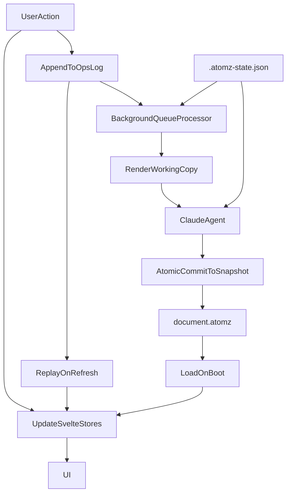

# atomz Architecture

This document describes the current runtime and persistence architecture of `atomz`, with a focus on the document sync model, Claude render flow, and crash/refresh recovery.

## Overview

`atomz` is a writing editor built around a structured document model:

- `atoms`: the source claims and hierarchy
- `prose`: the rendered essay text linked back to atoms
- `rules`: writing constraints
- `paraBreaks`: paragraph structure
- `editorPins`: prose-side pinned text
- `sections`: heading / section metadata

The app uses Svelte stores for the live UI, but durable state is now split into dedicated files with separate responsibilities.

## Main Files

### Canonical snapshot

- `document.atomz`

This is the committed document snapshot. It should represent the latest durable document state, not transient Claude runtime state.

### Runtime/session state

- `.atomz-state.json`

This stores non-document runtime metadata such as the current Claude `sessionId`.

### Append-only durable ops log

- `.atomz-ops.jsonl`

This is the durable append-only log used to preserve unresolved work across refreshes and crashes.

It currently stores two classes of events:

- queue events for background render work
- semantic document-op events for replayable user document mutations

### Render working copy

- `.atomz-render.atomz`

This is the temporary file Claude edits during `/api/render`. The canonical snapshot is only updated after the server validates and merges the result.

### Prose history

- `.atomz-history.json`

This stores prose-oriented history used by the versions UI.

## High-Level Model

## Client Architecture

### Live UI state

The client uses Svelte stores in `src/lib/stores.ts` for the interactive view:

- `fragments`
- `prose`
- `rules`
- `paraBreaks`
- `editorPins`
- `sections`
- `actionQueue`
- `documentOps`

Stores are not treated as the durable source of truth. They are the in-memory projection that powers the UI.

### Replayable document ops

The client now records a semantic subset of document mutations as `DocumentOp` values.

Current replayable op families:

- `edit_atom`
- `pin_atom_word`
- `pin_prose_text`
- `replace_prose`
- `replace_fragments`
- `replace_rules`
- `replace_sections`
- `replace_paragraph_structure`

These are applied locally immediately for responsiveness and are also appended to `.atomz-ops.jsonl` through `/api/document-ops`.

### Queue items

The background render queue still exists separately from document ops.

Queue items represent work that may require the Claude agent, such as:

- selective prose regeneration
- prose feedback processing
- pin reconciliation that cannot be resolved locally

Queue items are also durably logged so refresh does not silently lose pending work.

## Server Architecture

### `/api/document`

Reads and writes `document.atomz`.

This is the canonical snapshot endpoint.

### `/api/history`

Loads Claude conversation history using the `sessionId` from `.atomz-state.json`.

### `/api/ops`

Durable queue-event API backed by `.atomz-ops.jsonl`.

### `/api/document-ops`

Durable semantic document-op API backed by `.atomz-ops.jsonl`.

### `/api/render`

This is the Claude render path.

Current behavior:

1. Read current request document state from the client
2. Strip heading entries out of `prose` before Claude sees the file
3. Write agent input to `.atomz-render.atomz`
4. Run Claude against the render working copy
5. Read the edited working copy back
6. Reinsert heading entries
7. Renumber prose ids
8. Atomically commit the merged document into `document.atomz`

Important invariant:

- Claude edits `.atomz-render.atomz`
- only the server commit step writes `document.atomz`

This prevents mid-render corruption of the canonical snapshot.

## Refresh / Recovery Flow

On boot, the client does roughly this:

1. load `document.atomz`
2. hydrate core stores from the snapshot
3. load unresolved semantic document ops
4. replay them into stores
5. load unresolved queue items
6. resume background processing

This means a refresh can restore:

- committed document state
- unresolved user intent
- pending agent work

## Save / Commit Flow

### Save-to-disk

The client periodically materializes the current document stores into `document.atomz` through `/api/document`.

Before save completion, pending semantic document ops are persisted first. After a successful save, those ops are marked resolved.

### Render commit

When a render succeeds:

1. queue items that triggered the render are marked resolved
2. the merged render result becomes the new canonical snapshot
3. the live stores are updated from the result

## Current Timing Model

Timing constants are centralized in `src/lib/sync-timing.ts`.

Current values:

- `editorIdleMs = 10000`
- `queueProcessMs = 1500`
- `saveToDiskMs = 800`

### Meaning of each timer

- `editorIdleMs`
  - coalesces direct prose typing before emitting durable prose-replacement work

- `queueProcessMs`
  - batches queue-triggered Claude work into fewer render calls

- `saveToDiskMs`
  - debounces canonical snapshot writes

This is simpler than the earlier split queue timing model, but there are still multiple timers in the system.

## Why the Architecture Is Split This Way

The architecture intentionally separates four concerns:

- `document.atomz`
  - what the committed document is

- `.atomz-ops.jsonl`
  - what unresolved user intent still exists

- Svelte stores
  - what the UI should show right now

- `.atomz-render.atomz`
  - what Claude is currently editing

This avoids the older failure mode where one file was simultaneously:

- the saved document
- the agent scratch file
- the session metadata store

## Current Strengths

- refresh/crash recovery is materially better than before
- Claude no longer edits the canonical snapshot directly
- session metadata is separated from document content
- most meaningful document mutations are now replayable
- append-only ops provide a durable record of unresolved work

## Current Trade-offs

The architecture is better, but still not perfect.

### 1. One shared JSONL file for two event families

Queue events and semantic document-op events currently share `.atomz-ops.jsonl`.

That works because each parser filters by `event` type, but it is not the cleanest long-term structure.

### 2. Some ops are coarse replacements

Several structural mutations use coarse replay ops such as:

- `replace_fragments`
- `replace_rules`
- `replace_sections`
- `replace_paragraph_structure`

These are deterministic and safe to replay, but not as elegant as narrower semantic delta ops.

### 3. Multiple timers still exist

Even though the queue timing was simplified, the system still has:

- editor idle timing
- queue processing timing
- save debounce timing

This is acceptable for now, but it is still more orchestration than ideal.

### 4. Version history is still prose-oriented

`.atomz-history.json` remains prose-centric and is not yet a full document revision graph.

## Likely Next Improvements

If this architecture is evolved further, the next useful steps are:

1. split queue events and semantic document ops into separate durable logs
2. replace coarse `replace_*` ops with narrower semantic ops where worthwhile
3. reduce the timer model further
4. upgrade versions/history to full-document snapshots
5. make snapshot writes and op compaction more explicit

## Key Source Files

- `src/lib/stores.ts`
- `src/lib/types.ts`
- `src/lib/document-op-utils.ts`
- `src/lib/sync-timing.ts`
- `src/lib/server/document-files.ts`
- `src/lib/server/runtime-state.ts`
- `src/lib/server/queue-op-log.ts`
- `src/lib/server/document-op-log.ts`
- `src/routes/+page.svelte`
- `src/routes/api/document/+server.ts`
- `src/routes/api/render/+server.ts`
- `src/routes/api/history/+server.ts`
- `src/routes/api/ops/+server.ts`
- `src/routes/api/document-ops/+server.ts`
