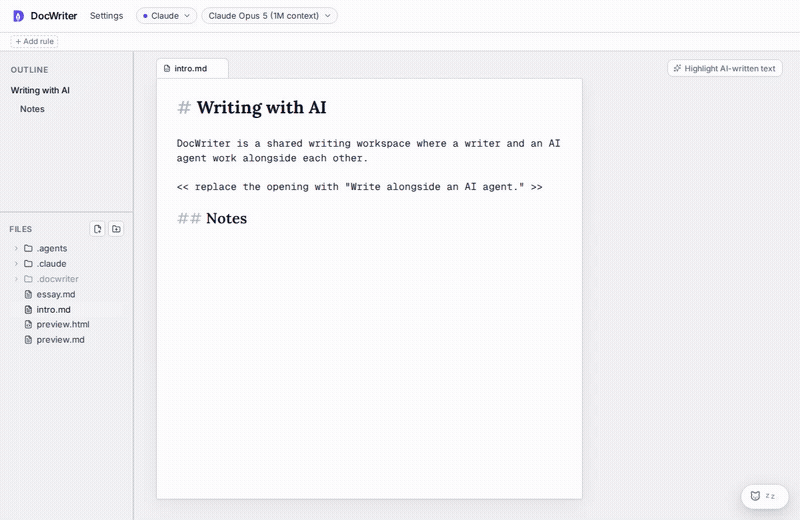

<p align="center">
  
</p>

<h1 align="center">DocWriter</h1>

<p align="center">
  <strong>Reimagining AI-assisted writing.</strong>
</p>

<p align="center">
  More of your voice, less AI slop.<br />
  Work in the same live draft, at the same time.<br />
  Choose whether the agent waits, comments, proposes changes, or edits directly.
</p>

<p align="center">
  <a href="https://docwriter.org">Website</a>
  ·
  <a href="https://docs.docwriter.org">Documentation</a>
  ·
  <a href="https://docs.docwriter.org/quickstart">Quickstart</a>
</p>

<p align="center">
  
</p>

DocWriter is a local writing workspace where you and an AI agent work alongside each other in the same draft. Write while the agent researches, comments, or proposes changes. Review agent work beside the text, then accept, reject, or respond.

- Work with Markdown, plain text, LaTeX, PDFs, and project files.
- Direct the agent through selected text, inline instructions, comments, or Chat.
- Keep writing while longer research and revision tasks run.
- Save ordinary local files that remain easy to inspect, version, and move.

## Get started

DocWriter requires Node.js 22.22.2.

```sh
git clone https://github.com/docwriter-org/docwriter.git
cd docwriter
nvm use
npm install
npm run build
npm link

docwriter ~/writing/my-project
```

See the [installation guide](https://docs.docwriter.org/install) and [quickstart](https://docs.docwriter.org/quickstart) for provider setup and the first editing workflow.

## Development

```sh
npm run dev
npm run check
npm run build
```

Use `npm run docs` to preview the documentation.

## Project

DocWriter is an open source research project from the [Carnegie Mellon University Computer Science Department](https://cs.cmu.edu) and [UC Berkeley EECS](https://eecs.berkeley.edu).
