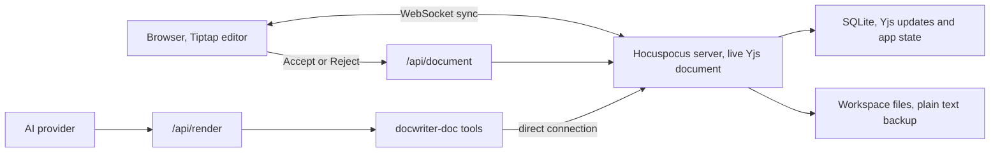

Read this page before changing document sync, agent edits, review actions, or file storage. The main rule is simple: the server owns the current document, and every browser and agent edits that same document.

## One live document for each open tab

Each open text tab has one live Yjs document inside the Hocuspocus server. The browser connects as a synchronized client. Agent tools open a direct server connection to the same document.

Never change an open tab by loading its saved updates into a temporary Yjs document. A temporary document is not connected to the browser, so the live editor will not receive the change.

## What happens when text changes

When the user types, the browser sends Yjs updates over the WebSocket. The server applies each update to the live document and saves it in SQLite.

When the agent proposes an edit, `edit_doc` adds a pending review to the live document. The committed text does not change yet. The browser uses the saved edit to show the proposed text beside the original text.

When the user accepts an edit, the server changes the affected paragraphs and removes the review in one transaction. When the user rejects an edit, the server removes the review without changing the text.

The browser undo manager tracks user typing and review actions. It does not add agent changes to the user's undo history.

## What gets saved

SQLite is the source of truth while DocWriter is running. The `yjs_updates` table stores document updates in its `payload` column. Other tables store tabs, rules, reviewers, sessions, and agent activity.

The server also writes plain text to the workspace file. The file makes the document easy to use with Git and other tools, but it is not a second live document. Saved files do not include the Yjs attribute that marks text written by AI.

Comments and pending reviews live inside the Yjs document. The committed text, comments, and reviews therefore reach every connected browser through the same update stream.

## How agent requests reach the document

The browser sends an agent request to `/api/render`. The route starts one provider query and sends activity events back to the agent dock.

The prompt lists the open tabs and describes what changed since the agent last saw them. The agent calls `read_doc` when it needs the full text. Reads and writes for open tabs go through the `docwriter-doc` tool server. Files under `.docwriter/agent/scratch/` use normal file operations.

Agent activity and document changes travel on separate connections. Activity appears through server sent events. Document changes appear through Yjs WebSocket updates.

## What happens after an external file change

When DocWriter opens a tab, the server rebuilds its Yjs document from SQLite. If the workspace file is newer and its text changed, the server uses the file instead.

Watch mode tells the browser to reload after an external file change. The browser then reconnects to the document held by the server.

## Where to make a change

- Document encoding, saved edit operations, and transaction origins are in `src/lib/shared/ydoc-codec.ts`.
- The Hocuspocus server and review actions are in `src/lib/server/ws-server.ts`.
- Agent document tools are in `src/lib/server/mcp-doc-tools.ts`.
- The provider request starts in `src/routes/api/render/+server.ts`.
- The editor and undo setup are in `src/lib/editor-extensions.ts`.
- Runtime state and SQLite access are in `src/lib/server/runtime-state.ts`.

Read [Editor and persistence](/contribute/editor-and-persistence) before changing the editor schema or file loading. Read [Providers and tools](/contribute/providers-and-tools) before changing an AI provider or tool.
