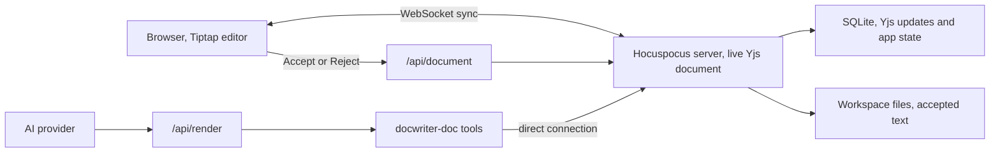

Read this page before you change the editor, document sync, review actions, undo, or file storage. You work with one live document for each tab; that document is in server memory, you access it through the browser or agent tools.

Send changes through the live server document. When you change a review action, limit it to the text in that proposal.

## Read and change a document

For each open text tab, you have a Yjs document in the Hocuspocus server. Read that live document when it is available; use `openDirectConnection` when you need to change it.

You can rebuild a document from its saved updates to read it when it is not open. Do not edit that temporary copy while a live document is available; your change would not be visible in the browser.

## Store proposed edits

When you type in the editor, each change is sent over a WebSocket and saved in SQLite.

For an `edit_doc` call, store the suggestion with the document. Use `insertion` marks for added words and `deletion` marks for removed words; each mark has a comment thread ID. For whole lines, you also store `suggest` and `suggestThread` on the paragraph. You can find these operations in `src/lib/shared/proposals.ts`.

Keep one thread for a passage. If you try to edit another thread's text, return an overlap error with that thread's ID. When you revise a suggestion on the same thread, replace its earlier proposal.

When you accept an edit in the UI, you keep the added text and remove the struck text; you also close the thread. When you reject or dismiss it, you remove the additions and keep the original text. You keep text you typed inside the suggestion in either case.

You can always read the expanded comment cards. Click a card or the struck text to see its additions; click elsewhere to hide them. Change their display in the browser without changing the stored proposal.

## Keep Markdown as text

Use the Tiptap Document, Paragraph, Text, and HardBreak nodes. Keep Markdown symbols in the text; use ProseMirror plugins for their display. You can show headings, tables, code, media, comments, and search results without adding a node type for each one.

Do not add StarterKit, Link, or Tiptap history. You already have a Yjs undo manager in `src/lib/editor-extensions.ts`.

Import `ySyncPluginKey` and the relative position helpers from `src/lib/editor-extensions.ts`. If you import the key from `y-prosemirror`, you get a different instance from the one in the collaboration extension; you can then have incorrect comment positions or checks for local edits.

Use the helpers in `src/lib/shared/ydoc-codec.ts` to read formatted text. The output of `Y.XmlText.toString()` can have XML tags; read text through `toDelta()`. When you insert text, set its attributes explicitly so it does not have the preceding character's marks.

## Save and load files

Use SQLite for saved document state. You will find document updates in `yjs_updates.payload`; tabs, rules, reviewers, sessions, and agent activity are in other tables.

You also get a plain text workspace file for use with Git and other tools. Your text and accepted edits are saved to that file; pending additions, comments, and AI authorship marks are only in Yjs.

Store comment messages in the document's comments map; use marks on the text to locate each thread. Text, comments, and proposals are then available through the same connection.

When you open a tab, its document is rebuilt from SQLite. If you changed the file in another app, the newer text is included; proposals outside the changed area are still available.

## Preserve undo and reconnects

Import `AGENT_ORIGIN`, `USER_ORIGIN`, and `SYSTEM_ORIGIN` from `src/lib/shared/ydoc-codec.ts`. You can identify the source of a change by its origin. Include local typing and review actions in the browser's undo history; exclude agent proposals.

For a review action, pause WebSocket sync before the HTTP request; apply the returned Yjs update locally with `USER_ORIGIN`, then reconnect. Include the success flag in batch responses too; without it, the local update will not be recorded for undo.

After a server module reload in Vite, reuse the global Hocuspocus instance so you do not bind the port twice. Wait for the first WebSocket sync before you display the editor; after a server restart, reconnect to the new instance.

## Send agent requests

Send an agent request to `/api/render`; you will receive activity updates in the agent dock during the provider query.

In the prompt, list the open tabs and your changes since the last agent request. Use `read_doc` for the full text; its output has pending edits as if you had accepted them. Use that text as the starting point for a revision.

Route open-tab reads and writes through the `docwriter-doc` tools. You can use normal file operations for files under `.docwriter/agent/scratch/`.

Keep agent activity and document updates separate. You receive activity through server-sent events, document updates through the Yjs WebSocket connection.

## Where to make a change

| If you need to change | Start here |
| --- | --- |
| Text encoding, comment storage, or update origins | `src/lib/shared/ydoc-codec.ts` |
| Proposals, text views, or accept and reject behavior | `src/lib/shared/proposals.ts` |
| Document sync or review requests | `src/lib/server/ws-server.ts` |
| Agent document tools | `src/lib/server/mcp-doc-tools.ts` |
| Provider requests | `src/routes/api/render/+server.ts` |
| Editor setup or undo | `src/lib/editor-extensions.ts` |
| Runtime state or SQLite access | `src/lib/server/runtime-state.ts` |

Read [Providers and tools](/contribute/providers-and-tools) before you change an AI provider or tool.

## Check your changes

Before you finish an editor or storage change, check these cases:

- Open the same file in two browser windows; type in one and check the other.
- Ask for an edit; accept it, then undo it.
- Ask for another edit; reject it.
- Turn on AI text highlighting; replace some of the highlighted text.
- Keep typing while an agent request is running.
- Change the file in another app while watch mode is on.
- Restart the server with both browser windows open.

You should see the same accepted text in both windows and the workspace file. The file should have no pending additions, the Markdown should have no AI authorship marks. Run `npm run check`, `npm run test:unit`, and `npm run build` before you finish.
