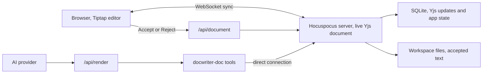

Read this page before you change the editor, document sync, review actions, undo, or file storage. You work with one live document for each tab; the server keeps that document in memory, browsers and agent tools connect to it.

Send changes through the live server document. When you change a review action, limit it to the text in that proposal.

## Read and change a document

For each open text tab, you have a Yjs document in the Hocuspocus server. Read that live document when it is available; use `openDirectConnection` when you need to change it.

You can rebuild a document from its saved updates to read it when it is not open. Do not edit that temporary copy while a live document exists; the browser would not receive your change.

## Store proposed edits

When you type in the editor, the browser sends each change over a WebSocket; the server saves it in SQLite.

When the agent calls `edit_doc`, you store the suggestion with the document. Use `insertion` marks for added words and `deletion` marks for removed words; each mark has a comment thread ID. For whole lines, you also store `suggest` and `suggestThread` on the paragraph. You can find these operations in `src/lib/shared/proposals.ts`.

Keep one thread for a passage. If an edit touches another thread's text, return an overlap error with that thread's ID; a revision on the same thread replaces its earlier suggestion.

When you accept an edit in the UI, the server keeps the added text and removes the struck text; it also closes the thread. When you reject or dismiss it, the server removes the additions and keeps the original text. Text you typed inside the suggestion stays in either case.

You can always read the expanded comment cards. Click a card or the struck text to see its additions; click elsewhere to hide them. The browser changes their display without changing the stored proposal.

## Keep Markdown as text

Use the Tiptap Document, Paragraph, Text, and HardBreak nodes. Keep Markdown symbols in the text; ProseMirror plugins handle their display. You can show headings, tables, code, media, comments, and search results without adding a node type for each one.

Do not add StarterKit, Link, or Tiptap history. You already have a Yjs undo manager in `src/lib/editor-extensions.ts`.

Import `ySyncPluginKey` and the relative position helpers from `src/lib/editor-extensions.ts`. If you import the key from `y-prosemirror`, you get a different instance from the one the collaboration extension uses; comment positions and checks for local edits can then fail.

Use the helpers in `src/lib/shared/ydoc-codec.ts` to read formatted text. `Y.XmlText.toString()` can include XML tags; read text through `toDelta()`. When you insert text, set its attributes explicitly so it does not inherit the preceding character's marks.

## Save and load files

Use SQLite for saved document state. You will find document updates in `yjs_updates.payload`; other tables hold tabs, rules, reviewers, sessions, and agent activity.

You also get a plain text workspace file for use with Git and other tools. The server writes your text and accepted edits to that file; pending additions, comments, and AI authorship marks stay in Yjs.

Store comment messages in the document's comments map; use marks on the text to locate each thread. Text, comments, and proposals then sync through the same connection.

When you open a tab, the server rebuilds its document from SQLite. If you changed the file in another app, the server reads that newer text into the document; pending proposals outside the changed area stay in place.

## Preserve undo and reconnects

Import `AGENT_ORIGIN`, `USER_ORIGIN`, and `SYSTEM_ORIGIN` from `src/lib/shared/ydoc-codec.ts`. The origin tells you where a change came from; local typing and review actions belong in the browser's undo history, agent proposals do not.

For a review action, pause WebSocket sync before the HTTP request; apply the returned Yjs update locally with `USER_ORIGIN`, then reconnect. Keep the success flag in batch responses too, or the browser will skip that local update and fail to record undo.

When Vite reloads a server module, reuse the global Hocuspocus instance so you do not bind the port twice. Wait for the first WebSocket sync before you display the editor; after a server restart, reconnect to the new instance.

## Send agent requests

Send an agent request to `/api/render`; the route starts a provider query and streams activity back to the agent dock.

In the prompt, list the open tabs and what changed since the agent last saw them. The agent can call `read_doc` for the full text; it reads pending edits as if you had accepted them, so it can revise a suggestion.

Route open-tab reads and writes through the `docwriter-doc` tools. You can use normal file operations for files under `.docwriter/agent/scratch/`.

Keep agent activity and document updates separate. You receive activity through server-sent events, document updates through the Yjs WebSocket connection.

## Where to make a change

| If you need to change | Start here |
| --- | --- |
| Text encoding, comment storage, or update origins | `src/lib/shared/ydoc-codec.ts` |
| Proposals, text views, or accept and reject behavior | `src/lib/shared/proposals.ts` |
| Document sync or review requests | `src/lib/server/ws-server.ts` |
| Agent document tools | `src/lib/server/mcp-doc-tools.ts` |
| Provider requests | `src/routes/api/render/+server.ts` |
| Editor setup or undo | `src/lib/editor-extensions.ts` |
| Runtime state or SQLite access | `src/lib/server/runtime-state.ts` |

Read [Providers and tools](/contribute/providers-and-tools) before you change an AI provider or tool.

## Check your changes

Before you finish an editor or storage change, check these cases:

- Open the same file in two browser windows; type in one and check the other.
- Ask for an edit; accept it, then undo it.
- Ask for another edit; reject it.
- Turn on AI text highlighting; replace some of the highlighted text.
- Keep typing while an agent request is running.
- Change the file in another app while watch mode is on.
- Restart the server with both browser windows open.

You should see the same accepted text in both windows and the workspace file. Pending additions should stay out of the file, AI authorship marks should not appear in the Markdown. Run `npm run check`, `npm run test:unit`, and `npm run build` before you finish.
