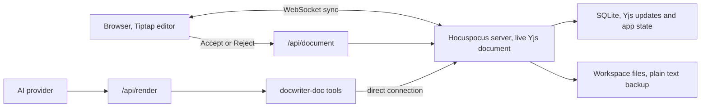

Read this page before changing the editor, document sync, review actions, undo, or file storage. The server owns the current document, and every browser and agent edits that same document.

Route every update through the live server document, and limit review actions to the text they cover. Treat workspace files as backups rather than a second live document.

## One live document for each tab

Each open text tab has one live Yjs document inside the Hocuspocus server. The browser connects as a synchronized client. Agent tools open a direct server connection to the same document.

Never change an open tab by loading its saved updates into a temporary Yjs document. A temporary document is not connected to the browser, so the live editor will not receive the change.

## Text and review changes

When the user types, the browser sends Yjs updates over the WebSocket. The server applies each update to the live document and saves it in SQLite.

When the agent proposes an edit, `edit_doc` adds a pending review to the live document. The committed text does not change yet. The browser uses the saved edit to show the proposed text beside the original text.

When the user accepts an edit, the server changes the affected paragraphs and removes the review in one transaction. When the user rejects an edit, the server removes the review without changing the text.

The browser undo manager tracks user typing and review actions. It does not add agent changes to the user's undo history.

## Editor representation

The Tiptap schema contains only Document, Paragraph, Text, and HardBreak. Markdown symbols remain in the text. ProseMirror plugins show headings, tables, code, media, comments, proposed edits, and search results without turning them into separate document nodes.

Do not add StarterKit, Link, or Tiptap history. Undo uses the Yjs undo manager configured in `src/lib/editor-extensions.ts`.

Import `ySyncPluginKey` and the relative position helpers from `src/lib/editor-extensions.ts`. The collaboration extension uses the key from `@tiptap/y-tiptap`. Importing the key from `y-prosemirror` creates a different key and breaks transaction classification and comment anchors.

AI provenance is stored as a Yjs text attribute. Use the delta based helpers in `src/lib/shared/ydoc-codec.ts` when reading or writing formatted text. `Y.XmlText.toString()` can return XML tags, and a plain insert can inherit attributes from the previous character.

## Persistence and file loading

SQLite is the source of truth while DocWriter is running. The `yjs_updates` table stores document updates in its `payload` column. Other tables store tabs, rules, reviewers, sessions, and agent activity.

The server also writes plain text to the workspace file and records its modification time. The file makes the document easy to use with Git and other tools, but it is not a second live document. Saved files do not include the Yjs attribute that marks text written by AI.

Comments and pending reviews live inside the Yjs document. The committed text, comments, and reviews therefore reach every connected browser through the same update stream.

When DocWriter opens a tab, the server first rebuilds its Yjs document from SQLite. A newer workspace file can replace the saved document when its text changed outside DocWriter. Read an open tab from the live Hocuspocus document when it is available. Mutations must use `openDirectConnection`.

## Undo and server restarts

Import `AGENT_ORIGIN`, `USER_ORIGIN`, and `SYSTEM_ORIGIN` from `src/lib/shared/ydoc-codec.ts`. The browser undo manager tracks local typing and review actions made with `USER_ORIGIN`, but it does not track agent proposals.

Vite can reload server modules while you develop. The global server guard prevents a second Hocuspocus server from binding to the same port. A browser waits for its first WebSocket sync before it paints the editor, and it reconnects to the new server instance after a restart.

## Agent requests

The browser sends an agent request to `/api/render`. The route starts one provider query and sends activity events back to the agent dock.

The prompt lists the open tabs and describes what changed since the agent last saw them. The agent calls `read_doc` when it needs the full text. Reads and writes for open tabs go through the `docwriter-doc` tool server. Files under `.docwriter/agent/scratch/` use normal file operations.

Agent activity and document changes travel on separate connections. Activity appears through server sent events. Document changes appear through Yjs WebSocket updates.

## Where to make a change

- Document encoding, saved edit operations, and transaction origins are in `src/lib/shared/ydoc-codec.ts`.
- The Hocuspocus server and review actions are in `src/lib/server/ws-server.ts`.
- Agent document tools are in `src/lib/server/mcp-doc-tools.ts`.
- The provider request starts in `src/routes/api/render/+server.ts`.
- The editor and undo setup are in `src/lib/editor-extensions.ts`.
- Runtime state and SQLite access are in `src/lib/server/runtime-state.ts`.

Read [Providers and tools](/contribute/providers-and-tools) before changing an AI provider or tool.

## Check an architecture change

Test the following behavior by hand:

- Open the same file in two browser windows and type in one window.
- Propose an agent edit, then accept and undo it.
- Propose another edit, then reject it.
- Turn on AI provenance highlighting and replace part of the marked text.
- Keep typing while an agent request is running.
- Change the file outside DocWriter while watch mode is on.
- Restart the server while both browser windows are open.

Both windows and the workspace file should contain the same accepted text. Rejected text should never enter the committed document, and AI provenance should remain invisible in the saved Markdown. Run `npm run check` and `npm run build` after the manual checks.
