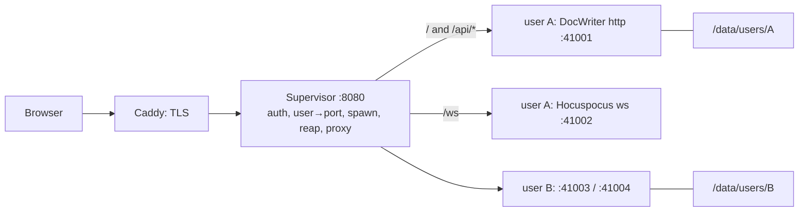

Implementation plan for the design chosen in [Hosting](/contribute/hosting): one big machine, one sandboxed DocWriter process per user, a supervisor that spawns and reaps them. Work through the phases in order; each ends with something you can run.

## Shape



Each user process is the CLI build, unchanged, bound to `127.0.0.1` on two ports the supervisor picks. The supervisor is the only listener on the public interface. It proxies HTTP to the process's app port and `/ws` upgrades to its Hocuspocus port, so the app never needs a single-port mode.

Per-user state is a directory on the machine's disk:

```
/data/users/<uid>/
  workspace/        DOCWRITER_ROOT: the user's files and .docwriter/
  home/             HOME: ~/.docwriter/keys.env, ~/.claude/ transcripts
```

## Phase 0: measure before building

Half a day. Numbers here decide the machine size and the per-process memory cap.

1. Build the app and run one process against a realistic workspace.
2. Record resident memory idle, during a render, and during a critique pass. The `claude` subprocess is the bulk and only exists during a render.
3. Confirm bubblewrap works on the target host: `bwrap --unshare-all --share-net --ro-bind / / --dev /dev --proc /proc -- node -e 1`. It needs unprivileged user namespaces. A plain VM has them; a Docker container blocks them under the default seccomp and AppArmor profiles, so if the host is a container it needs those relaxed or the sysbox runtime. A Fly machine is a VM and works as is.
4. Size the machine from the numbers. As a placeholder until measured:

| Per process | Estimate |
|---|---|
| Idle DocWriter | ~150 MB |
| During a render | +300 to 400 MB |
| 50 active, half rendering | ~17 GB |

A 32 GB VM or a 64 GB dedicated box covers a thousand accounts at fifty active with room to spare.

## Phase 1: app changes

One small PR against `main`. Everything else in this plan lives under `deploy/` and never touches app code.

1. **Same-origin WebSocket URL.** `wsUrl()` in `src/lib/yjs-doc.ts` builds `ws://<hostname>:<port>`. Add a runtime public variable, `PUBLIC_DOCWRITER_WS_URL`; when set, return it verbatim. The supervisor sets it to `wss://app.docwriter.org/ws`. Hocuspocus carries the document name in messages, not the URL path, so a fixed path works. The CLI is unaffected: the variable is unset, and the existing port logic runs.
2. **Health route.** `GET /api/health` returning `{ ok: true }`. The supervisor polls it after spawn to know when to start proxying, instead of guessing at boot time.
3. **Proxy headers.** Confirm adapter-node's `ORIGIN`, `PROTOCOL_HEADER`, and `HOST_HEADER` are honored when set in the process environment; the supervisor passes `ORIGIN=https://app.docwriter.org`, `PROTOCOL_HEADER=x-forwarded-proto`, `HOST_HEADER=x-forwarded-host`. No code change expected, but check it against a POST from the editor.

Validate with `npm run check` and `npm run test:unit`, then run the CLI once to confirm nothing changed for local use.

## Phase 2: the supervisor

`deploy/supervisor/`, a small Node service. Around three hundred lines, in TypeScript so it can be checked with the rest of the repo. Responsibilities, each a module:

- **Registry.** SQLite file mapping user id to numeric uid, app port, ws port, process state, last activity. Ports come from a fixed range. Uids come from a fixed range starting at 20000, so every user is a distinct Linux user and filesystem permissions isolate them even if the sandbox does not.
- **Spawner.** On first request for a user with no live process: create the directories if missing, chown to the user's uid, then spawn:

  ```
  systemd-run --scope -p MemoryMax=1500M -p CPUWeight=100 \
    bwrap --unshare-all --share-net --die-with-parent \
      --unshare-user --uid <uid> --gid <uid> \
      --ro-bind /usr /usr --ro-bind /etc/ssl /etc/ssl --ro-bind /etc/resolv.conf /etc/resolv.conf \
      --ro-bind /app/current /app \
      --bind /data/users/<uid>/workspace /workspace \
      --bind /data/users/<uid>/home /home/user \
      --dev /dev --proc /proc --tmpfs /tmp \
      --setenv HOME /home/user \
      --setenv DOCWRITER_ROOT /workspace \
      --setenv PORT <app port> --setenv HOST 127.0.0.1 \
      --setenv DOCWRITER_WS_PORT <ws port> --setenv PUBLIC_DOCWRITER_WS_PORT <ws port> \
      --setenv PUBLIC_DOCWRITER_WS_URL wss://app.docwriter.org/ws \
      --setenv ORIGIN https://app.docwriter.org \
      --setenv PROTOCOL_HEADER x-forwarded-proto --setenv HOST_HEADER x-forwarded-host \
      --setenv ANTHROPIC_API_KEY <shared key, or omit for bring-your-own> \
      -- node /app/build/index.js
  ```

  This spawns `build/index.js` directly with the same environment `bin/docwriter.js` would pass, minus the port probing and browser opening. `systemd-run --scope` puts the process in its own cgroup so the memory cap kills only that user's process. The network namespace is shared because the process has to reach the API and the supervisor has to reach its ports.
- **Readiness.** Poll `/api/health` on the app port until it answers, with a timeout; show a plain "starting your workspace" page meanwhile and refresh.
- **Proxy.** `http-proxy` handles both HTTP and WebSocket upgrades. Route by the session cookie's user id: `/ws` to the ws port, everything else to the app port. Set `x-forwarded-proto` and `x-forwarded-host`.
- **Reaper.** Track open WebSocket connections per user through the proxy. When a user has had none for ten minutes, send `SIGTERM`. DocWriter flushes dirty tabs on document unload, so a clean shutdown loses nothing. Escalate to `SIGKILL` after thirty seconds.
- **Limits.** A cap on concurrent processes; past it, new sign-ins queue with a message rather than overcommitting memory. A per-user spawn rate limit.

Test locally on any Linux box with bubblewrap: two fake users, a Bash call from user A's agent that lists `/workspace` and sees only A's files, an attempt to read B's directory that fails, a WebSocket sync through the proxy, a reap after idle followed by a reconnect that shows the same document, and a render that exceeds `MemoryMax` and kills only that process.

## Phase 3: auth

The supervisor owns sign-in. Two acceptable choices, one file either way:

- **GitHub OAuth.** Free, about eighty lines with no library, and the user id is the GitHub id. Right for a study or a beta where everyone has GitHub.
- **Clerk.** Email, magic link, and social sign-in with a hosted UI. The sign-in page from the closed PR #51 can be reused almost unchanged. The free tier covers far more than a thousand monthly users.

Either way: a signed session cookie, an allowlist file for invite-only phases, and a sign-out route. The app processes never see any of this; they trust whatever reaches their localhost ports, which only the supervisor can do.

## Phase 4: machine and deploys

`deploy/` holds everything the machine needs. Provision once by hand or with a shell script, not a config management tool:

1. Ubuntu LTS VM, bubblewrap and Node 22 installed, a data disk mounted at `/data`.
2. Caddy in front, terminating TLS for `app.docwriter.org` and proxying to the supervisor on `127.0.0.1:8080`. Caddy's automatic certificates remove the DNS and cert steps the closed PR had.
3. A systemd unit for the supervisor, restart on failure, logs to journald with the user id in each line.
4. Releases under `/app/releases/<git sha>/` with `/app/current` a symlink. A GitHub Actions job on push to `main` runs `npm ci`, `npm run build`, `npm prune --omit=dev`, rsyncs the tree to a new release directory, and flips the symlink. New spawns use the new build; running processes keep the old one until reaped. Since bubblewrap binds `/app/current` at spawn, a process is never torn out from under a user mid-session.
5. A rollback is moving the symlink back.

## Phase 5: state and backups

The machine's disk is the primary store. A VM disk persists across reboots, so restore-on-spawn is not needed until there is more than one machine.

- **Continuous.** Litestream, one process for the machine, watching every `/data/users/*/workspace/.docwriter/docwriter.db` and replicating to a bucket prefix per user. SQLite is the source of truth and the Yjs log rebuilds the markdown, so this protects the writing with about a second of loss on a hard failure.
- **Hourly.** `rclone sync /data/users <bucket>/users` from a systemd timer for everything Litestream does not cover: references, PDFs, skills, hooks, scratch, `home/`.
- **Drill.** Before launch, restore one user's prefix onto a scratch VM and open their document. A backup nobody has restored is a hope.
- **Growth.** `.docwriter/backups/` is pruned by the app; watch total disk with an alert at 80 percent. Add a per-user size cap only if someone hits it.

## Phase 6: observability and launch

- The supervisor exposes `/metrics` with active processes, spawns per minute, spawn-to-ready latency, reaps, and memory-cap kills. Scrape it or just log it.
- Alerts: machine memory above 80 percent, disk above 80 percent, the supervisor restarting, the concurrent-process cap reached.
- Model spend: decide bring-your-own-key or a shared key before opening sign-ups. With a shared key, the key's rate limit tier is the real concurrency ceiling, not the machine. With bring-your-own, the existing API keys panel writes to `~/.docwriter/keys.env`, which lives in the user's `home/` and just works.
- Launch checklist: restore drill done, memory cap tested, allowlist in place, alerts wired, a rollback rehearsed once.

## Out of scope for now

Multi-machine routing, warm process pools, the Claude subscription login inside the sandbox, and a hosted landing page redesign. The first of these is the only one with a known path: the spawner's "start a process" becomes "start a machine", and the registry gains a machine column.

## Order of work

| Phase | Effort | Ends with |
|---|---|---|
| 0 Measure | half a day | a machine size and a memory cap |
| 1 App changes | half a day | a merged PR on `main` |
| 2 Supervisor | 2 to 3 days | two sandboxed users on a laptop |
| 3 Auth | 1 day | sign-in with an allowlist |
| 4 Machine and deploys | 1 day | `app.docwriter.org` serving `main` |
| 5 State and backups | 1 day | a restore that worked |
| 6 Observability and launch | 1 day | alerts and the checklist |
