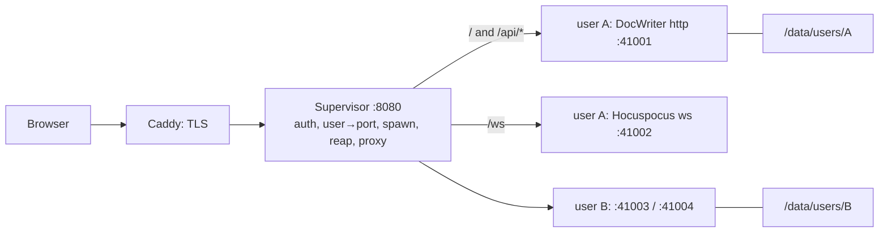

Implementation plan for the design chosen in [Hosting](/contribute/hosting): one big machine, one sandboxed DocWriter process per user, a supervisor that spawns and reaps them. Work through the phases in order; each ends with something you can run.

**Status.** Phases 1 through 5 are implemented under `deploy/` and `src/`, with unit and integration tests, and verified by hand under bubblewrap in a container. What remains is done on a real machine: run the provisioning script, measure memory during a render, and do the restore drill. The runbook is `deploy/README.md`.

## Shape



Each user process is the CLI build, unchanged, bound to `127.0.0.1` on two ports the supervisor picks. The supervisor is the only listener on the public interface. It proxies HTTP to the process's app port and `/ws` upgrades to its Hocuspocus port, so the app never needs a single-port mode.

Per-user state is a directory on the machine's disk:

```
/data/users/<uid>/
  workspace/        DOCWRITER_ROOT: the user's files and .docwriter/
  home/             HOME: ~/.docwriter/keys.env, ~/.claude/ transcripts
```

## Phase 0: measure before building

Half a day. Numbers here decide the machine size and the per-process memory cap.

1. Build the app and run one process against a realistic workspace.
2. Record resident memory idle, during a render, and during a critique pass. The `claude` subprocess is the bulk and only exists during a render.
3. Confirm bubblewrap works on the target host: `bwrap --unshare-all --share-net --ro-bind / / --dev /dev --proc /proc -- node -e 1`. It needs unprivileged user namespaces. A plain VM has them; a Docker container blocks them under the default seccomp and AppArmor profiles, so if the host is a container it needs those relaxed or the sysbox runtime. A Fly machine is a VM and works as is.
4. Size the machine from the numbers. Measured so far, on the production build inside bubblewrap in a container:

| Per process | Measured | Still to measure |
|---|---|---|
| Idle DocWriter (Node, Hocuspocus, one open tab) | 164 MB resident | |
| Spawn to `/api/health` answering | 0.8 s | |
| Reap (SIGTERM to exit) | under 50 ms | |
| During a render | | needs an API key on the machine; expect +300 to 400 MB for the `claude` subprocess |

At those numbers, 50 active users with half of them rendering is roughly 17 GB. A 32 GB VM or a 64 GB dedicated box covers a thousand accounts at fifty active with room to spare.

## Phase 1: app changes

One small change set on `main`, done. Everything else in this plan lives under `deploy/` and never touches app code.

1. **Gateway trust.** `DOCWRITER_GATEWAY_SECRET` (`src/lib/server/gateway.ts`). When set, the SvelteKit handle in `hooks.server.ts` returns 403 to any request without the `x-docwriter-gateway` header, and the Hocuspocus `onUpgrade` hook refuses a WebSocket handshake without it. This is what makes process-per-user sound on a shared network namespace: every user process could otherwise connect to every other user's localhost ports. Unset, the CLI behaves as before.
2. **Same-origin WebSocket URL.** `PUBLIC_DOCWRITER_WS_URL` in `wsUrl()` (`src/lib/yjs-doc.ts`). The supervisor sets it to `wss://<domain>/ws` so the browser never needs a port. Hocuspocus carries the document name in messages, not the URL path.
3. **Health route.** `GET /api/health` returns `{ ok: true }` without touching the database or workspace; the supervisor polls it after spawning.
4. **Bind address.** The Hocuspocus server now follows `HOST` (or `DOCWRITER_WS_HOST`) instead of always listening on every interface. `vite dev` is unchanged.

No single-port mode was needed: the supervisor is a reverse proxy anyway, so it forwards `/ws` to the process's WebSocket port and everything else to its HTTP port.

## Phase 2: the supervisor

`deploy/supervisor/`, plain ESM JavaScript on the Node standard library plus `better-sqlite3`, started with `npm run supervisor`. About six hundred lines across small modules, each with tests under `deploy/supervisor/test/`:

- **`registry.js`.** SQLite file mapping user id to a numeric uid and two localhost ports, allocated once and stable for the life of the user. Uids start at 20000, ports at 41000.
- **`sandbox.js`.** Pure functions that build the environment the CLI launcher would pass, and the `bwrap` argument list: fresh user, pid, ipc and uts namespaces, `/usr` read-only, the release at `/app`, the user's directories at `/workspace` and `/home/user`, a generated `/etc/passwd`, `--clearenv` and `--setenv` for everything the app reads. The network namespace is shared. The supervisor drops to the user's uid before exec, so bubblewrap runs unprivileged.
- **`cgroup.js`.** A cgroup v2 leaf per process with `memory.max` and `pids.max`, created by the supervisor itself under its own delegated cgroup. No `systemd-run`. Missing delegation degrades to no limits with a warning.
- **`processes.js`.** Spawn, readiness poll on `/api/health` with the process's own gateway secret, activity and WebSocket counting, the idle reaper, the process cap, a per-user respawn cooldown, and stop (SIGTERM to the Node process found by walking `/proc`, then SIGKILL through the cgroup after the grace period).
- **`proxy.js`.** HTTP forwarding on `node:http` and WebSocket upgrades on `node:net`, adding the gateway secret and the `x-forwarded-*` headers. No buffering, so SSE renders stream through.
- **`auth.js`, `session.js`.** GitHub OAuth or a dev mode, HMAC-signed cookies, an allowlist file.
- **`main.js`.** One HTTP server: `/auth/*`, `/__supervisor/metrics` and `healthz`, and everything else proxied to the signed-in user's process, spawning it first if needed and showing a "starting" page if that takes more than 25 seconds.

Verified: the integration test runs the supervisor against a fake app; a manual run put the real build under bubblewrap as root, opened a tab, synced a Yjs document through the proxied WebSocket with the real Hocuspocus provider, typed into it, reaped the process, found the text in the file on disk, and respawned. Direct connections to both of the process's ports were refused with 403.

## Phase 3: auth

The supervisor owns sign-in. Done: GitHub OAuth with the `read:user` scope, the user id `gh:<numeric id>` so renames do not create a new workspace, a signed session cookie, an allowlist file for invite-only phases, and a sign-out route. `SUPERVISOR_AUTH=dev` accepts any name for laptops and tests. The app processes never see any of this; they trust the gateway header, which only the supervisor sends.

Clerk would slot into `auth.js` in place of the GitHub flow if email or magic-link sign-in is wanted later.

## Phase 4: machine and deploys

`deploy/machine/` holds everything the machine needs, written and not yet run on a real host:

1. `provision.sh`: Ubuntu 24.04, installs bubblewrap, Node 22, Caddy, Litestream and rclone, checks that an unprivileged user can run bubblewrap, lays out `/app` and `/data`, writes a `supervisor.env` template, installs the units, and opens the firewall for 22, 80 and 443 only.
2. `Caddyfile`: TLS for the domain with automatic certificates, proxying to the supervisor on `127.0.0.1:8080` with no upstream timeouts, so SSE renders and WebSockets live as long as they need.
3. `docwriter-supervisor.service`: restart on failure, `Delegate=yes` for the per-process cgroups, logs to journald.
4. `release.sh` and `.github/workflows/deploy-hosted.yml`: on push to `main`, run the checks and tests, build, prune to production dependencies, pack, copy to the machine, unpack under `/app/releases/<sha>/`, flip the `/app/current` symlink, restart the supervisor. Running processes keep the old release until reaped. The workflow is off until the repository variable `HOSTED_DEPLOY_ENABLED` is `true`.
5. A rollback is moving the symlink back.

## Phase 5: state and backups

The machine's disk is the primary store. A VM disk persists across reboots, so restore-on-spawn is not needed until there is more than one machine.

- **Continuous.** `deploy/backup/litestream.yml`: one Litestream process for the machine, watching every `/data/users/*/workspace/.docwriter/docwriter.db` and replicating to a bucket prefix per user. SQLite is the source of truth and the Yjs log rebuilds the markdown, so this protects the writing with about a second of loss on a hard failure.
- **Hourly.** `deploy/backup/backup.sh` on a systemd timer: `rclone sync` of `/data/users` for everything Litestream does not cover: references, PDFs, skills, hooks, scratch, `home/`.
- **Drill.** Before launch, restore one user's prefix onto a scratch VM and open their document. A backup nobody has restored is a hope.
- **Growth.** `.docwriter/backups/` is pruned by the app; watch total disk with an alert at 80 percent. Add a per-user size cap only if someone hits it.

## Phase 6: observability and launch

- The supervisor exposes `/metrics` with active processes, spawns per minute, spawn-to-ready latency, reaps, and memory-cap kills. Scrape it or just log it.
- Alerts: machine memory above 80 percent, disk above 80 percent, the supervisor restarting, the concurrent-process cap reached.
- Model spend: decide bring-your-own-key or a shared key before opening sign-ups. With a shared key, the key's rate limit tier is the real concurrency ceiling, not the machine. With bring-your-own, the existing API keys panel writes to `~/.docwriter/keys.env`, which lives in the user's `home/` and just works.
- Launch checklist: restore drill done, memory cap tested, allowlist in place, alerts wired, a rollback rehearsed once.

## Out of scope for now

Multi-machine routing, warm process pools, the Claude subscription login inside the sandbox, and a hosted landing page redesign. The first of these is the only one with a known path: the spawner's "start a process" becomes "start a machine", and the registry gains a machine column.

## Order of work

| Phase | State | Ends with |
|---|---|---|
| 0 Measure | idle and spawn measured; render memory needs a key | a machine size and a memory cap |
| 1 App changes | done, on this branch | a merged PR on `main` |
| 2 Supervisor | done, tested | two sandboxed users on a laptop |
| 3 Auth | done, GitHub flow tested with a fake GitHub | sign-in with an allowlist |
| 4 Machine and deploys | files written, not yet run on a host | the domain serving `main` |
| 5 State and backups | files written, restore drill pending | a restore that worked |
| 6 Observability and launch | metrics endpoint done; alerts and checklist pending | alerts and the checklist |
