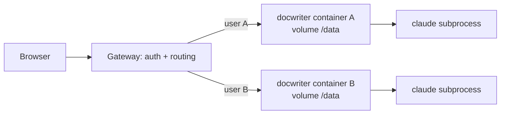

Read this page before starting a hosted deployment. It records why the earlier multi-tenant attempt (PR #51, closed) was abandoned and the approach to use instead.

## The constraint

DocWriter is a single-tenant process by design. One process owns one workspace root, one SQLite file, one Hocuspocus server, and one agent session:

- `DOCWRITER_ROOT` is read once at module load (`document-files.ts`, `workspace-path.ts`) and every path helper builds on that constant.
- `getDb()` is a process-wide singleton, and `globalThis.__docwriterWsServer` is the one live document server.
- The agent is a real `claude` subprocess with `cwd` set to the workspace root. It reads the workspace with the built-in Read, Glob, Grep, and Bash tools, which make ordinary filesystem calls. User hooks run shell commands the same way.
- Provider credentials come from the process environment and `~/.claude`.

This is why a "mock filesystem" does not fit. The editor's own file access could be virtualized, but the agent's cannot: the SDK spawns a separate process that expects real files. The only way to give it a virtual filesystem is to copy files out to a sandbox, run, and copy them back, which is the sandboxed runner PR #51 had to build.

## Why the agent is a subprocess

The Claude provider uses `@anthropic-ai/claude-agent-sdk`, which is Claude Code packaged as a library: `query()` starts the Claude Code CLI as a child process and talks to it over stdio. DocWriter depends on that harness, not just the model. The built-in Read, Glob, Grep, Bash, and web tools, the project skills and `.claude/CLAUDE.md` rules that reach the model through `settingSources`, session resume, plan mode, hooks, and subscription login with no API key all come from the CLI. The other providers are the same shape: Codex, Cursor, and Pi are each a coding-agent harness with its own tools and login.

That is the product decision underneath every hosting choice on this page. DocWriter is a document layer over coding-agent harnesses, so hosting it means hosting a small development environment per user, the way code-server and JupyterHub do.

The one design that escapes this is a hosted-only agent that does not use a harness at all: an in-process loop over the Messages API with only the document tools, no filesystem, no subprocess. A shared multi-tenant server then becomes viable, and the tenancy work shrinks to the data layer. The price is a second agent runtime maintained next to the CLI one, no Bash, hooks, skills, or non-Claude providers for hosted users, and a second implementation of everything that consumes the SDK's event stream. Take it only if the hosted product is meant to be a lighter thing than the CLI.

## What PR #51 tried

PR #51 retrofitted tenancy into the single process. Every request ran inside an `AsyncLocalStorage` user scope, every server module resolved the user's root and database through that scope, `~/.claude` state was relocated per user, and agent Bash calls shipped a bundle of workspace files (up to 16 MB) to a remote runner app and merged the results back.

The cost was 71 changed files and about 13k added lines, most of them touching the modules that change every week. The branch fell 215 commits behind `main` and could not be merged. Any design that makes the server tenant-aware has this property: tenancy becomes a cross-cutting concern, and every future change on `main` has to be tenant-aware too.

## The approach to use: one container per workspace

Keep the app single-tenant and put the multi-tenancy outside it. Each user (or each workspace) gets their own container running the same build the CLI ships, with its own persistent volume mounted at the workspace root. This is how code-server, JupyterHub, Coder, and Gitpod host a single-user tool for many users.



What this buys:

- **No app changes for tenancy.** The container runs `docwriter --root /data --host --no-open` with an API key in the environment. `main` and the hosted build are the same code.
- **The container is the sandbox.** Agent Bash, user hooks, and scratch files stay inside the user's own container. No remote runner, no file bundling.
- **Isolation for free.** One user's SQLite, Yjs log, provider session, and `~/.claude` state cannot touch another's.
- **Idle cost is storage.** Machines stop when the WebSocket has been closed for a while and start on the next request.

## Recommended stack

Fly.io fits because it treats a machine per user as a first-class pattern and PR #51 already targeted it.

1. **Image.** A `Dockerfile` that builds the app with adapter-node and installs the Claude CLI. PR #51's `Dockerfile` and `.dockerignore` are a good starting point once the multi-tenant environment variables are removed.
2. **Single port.** Fly routes one port per machine, so the Hocuspocus WebSocket must share the HTTP port. Add an environment flag that makes `createWsServer` skip binding its own port and expose an upgrade handler that a small production entry point wires to `/ws`. PR #51's `server.js` shows the shape (about 30 lines). The client's WebSocket URL must then derive from the page origin instead of a fixed port.
3. **Health check.** A `GET /api/health` route returning 200 so the platform can tell a live machine from a booting one.
4. **Per-user machine and volume.** A gateway creates a Fly Machine and a volume the first time a user signs in and stores the mapping in its own small database. It reuses them on later visits.
5. **Routing.** The gateway authenticates the user, then answers with a `fly-replay: instance=<machine-id>` header so Fly's proxy forwards the request, WebSocket included, to that machine. The container itself listens only on the private network and checks a shared secret header so it cannot be reached except through the gateway.
6. **Auth.** Clerk on the gateway only. The app never sees Clerk; PR #51's sign-in page can be reused there.
7. **Deploys.** Rebuilding the image and updating each machine's image is the whole deploy. Users' volumes are untouched.

Keep the landing site on Vercel as it is now. The `landing` branch and its sync workflow are unrelated to the hosted editor and stay as they are.

## Scaling to 1000 users

A thousand accounts does not change the design. It changes what has to be automated on day one.

Per-user machines scale better than a shared server here for two reasons. First, a shared server would still need to pin each document to one instance, because Hocuspocus keeps the live Y.Doc in memory; scaling a shared server past one instance means sticky routing or a Redis-backed sync layer, which per-user machines give you by construction. Second, every render spawns a `claude` subprocess that holds a few hundred megabytes; a shared server running 50 of those at once is one big box under memory pressure, while 50 user machines are 50 small boxes that each stop when idle.

What matters is concurrency, not the account count. Most of a thousand accounts are idle at any moment, and stopped machines cost nothing beyond their disk.

| Item | Rough monthly cost, 1000 accounts, ~50 active at once |
|---|---|
| 1000 volumes at 1 GB each | ~$150 |
| ~50 running 1 GB machines, stopped when idle | ~$300 |
| 950 stopped machines | ~$0 |
| Agent API spend | dominant, and set entirely by usage |

Hosting is not the expensive line. The model spend is, so decide early whether users bring their own key (the API keys panel already stores one per workspace, which in this design is per container) or the deployment funds a shared key with a rate limit tier to match.

Things that must be true from the first sign-up at this scale:

- **Provisioning is code.** The gateway creates the machine and volume through the Machines API on first sign-in. Nobody creates machines by hand.
- **Quotas are raised ahead of time.** Fly caps machines and volumes per organization by default; ask for the limit before launch, not during it.
- **State outlives the machine.** Either back volumes up, or skip volumes entirely as described in the next section.
- **Idle machines stop.** Configure auto-stop on WebSocket disconnect with a short grace period, and measure resume time on the real image. A stopped machine resumes in about a second; a suspended one faster.
- **The image is small.** Cold start scales with image size, and a thousand machines pull it.

If the first launch is a study with a known list of participants, the same gateway still applies; skipping it only works for a handful of people.

## Cheaper variant: stateless machines, state in object storage

The per-user volume is the one recurring cost that idle users still pay, and it is also the operational burden: a volume is pinned to a host, needs snapshots, and counts against a quota. Drop it.

A workspace is small: a few markdown files, a SQLite file of a few megabytes, and whatever references the user uploaded. Keep it in a bucket instead, one prefix per user, and make the machine a cache of it:

- **The SQLite file streams continuously.** Run Litestream as a sidecar process inside the container, replicating `.docwriter/docwriter.db` to the user's prefix. SQLite is the source of truth and the Yjs log rebuilds `document.md`, so this alone protects the writing. The loss window on a hard kill is about a second of WAL.
- **Everything else syncs on a timer and on shutdown.** An entrypoint script restores the prefix into `/data` before starting DocWriter, runs `rclone sync` every minute, and runs it once more on `SIGTERM`. References, uploaded PDFs, skills, hooks, and scratch files travel this way.
- **Agent session state lives under the workspace.** Set `CLAUDE_CONFIG_DIR` to a directory under `/data` so the CLI's transcripts, which `resume` needs, persist with the rest instead of in the container's home directory.

Machines then become fungible. Destroy an idle one instead of stopping it, recreate it on the next sign-in from the same image, and let it restore in the entrypoint. Nothing on the machine is unique, so a lost host is a cold start, not lost work.

| Item | Rough monthly cost, 1000 accounts, ~50 active at once |
|---|---|
| Object storage, 1000 workspaces at ~1 GB | ~$20 |
| ~50 running machines, destroyed when idle | ~$150 to $300, depending on machine size |
| Idle accounts | $0 |

The app code stays the same three changes as before. The state layer is entirely deploy-side: the entrypoint script, a Litestream config, and the bucket. Nothing on `main` learns about hosting.

Machine size is the other lever, and it should be measured, not guessed: boot the real image, open a document, run a render, and read peak memory. Node plus Hocuspocus is small; the `claude` subprocess is the bulk, and it only exists during a render.

## Cheapest sound option: one process per user on a shared machine

The isolation boundary does not have to be a machine. It can be a process. Each user still gets their own single-tenant DocWriter, but a supervisor on one large machine spawns it on demand instead of the platform booting a VM:

```
bwrap --unshare-all --share-net \
      --ro-bind /usr /usr --ro-bind /app /app \
      --bind /data/<user> /workspace --tmpfs /tmp \
      -- node /app/build --root /workspace --port <p>
```

- **The supervisor** maps user to port, spawns the process on the first request, and kills it after the WebSocket has been idle for a few minutes. That is the same two hundred lines the machine gateway would be, minus the Machines API.
- **Bubblewrap wraps the whole DocWriter process**, not just the `claude` subprocess, so Bash, hooks, and synctex are all confined to that user's directory. It needs only user namespaces, which a Fly machine or any VM provides. gVisor gives stronger isolation but runs poorly nested inside a VM and is not needed when every process is your own build.
- **State is the same bucket layer** as above, restored per user when their process starts and synced while it runs.
- **The app is untouched.** Each process is the CLI build with `--root` and `--port`, so the same three app-side changes apply and `main` stays the only branch.

This is how JupyterHub's local process spawner works, and it is the cheapest version that is still sound. One 8 GB machine holds roughly thirty to sixty active users, depending on measured memory per process, at about forty dollars a month always on. A second machine covers a thousand accounts at fifty active.

What it gives up relative to a machine per user:

- **Neighbors share CPU.** One user's heavy render slows the others on that machine. Memory is bounded per process by a cgroup or `ulimit`, but CPU fairness is only what the kernel scheduler gives you.
- **A crash is shared.** The supervisor can restart one process, but a kernel-level problem or a full disk takes every user on the machine down together.
- **The ceiling is one machine.** Past what one machine holds, the supervisor has to route across machines, which is the multi-machine gateway you avoided. Plan for it as an upgrade, not a rewrite: the supervisor's spawn call changes from "start a process" to "start a machine" and nothing else moves.

Recommendation: start here. The supervisor is the only new code, the image and entrypoint are shared with the machine-per-user design, and the switch to machines later is contained in the spawner. The step-by-step version is on the [Hosting plan](/contribute/hosting-plan) page.

## Why not the browser or a shared server

**Running the harness client side** is not a hosting strategy for DocWriter; it is a different application. The Agent SDK's `query()` is a wrapper around a `claude` subprocess, so nothing in it runs in a browser. The agent loop, prompt building, the document tools, the review rounds, the critique and feedback passes, style analysis, and the live Y.Doc all live in the server code, most of it against SQLite and Hocuspocus. Moving the agent into the browser means rewriting that layer against the browser's Y.Doc replica, dropping Bash, hooks, skills, and the four non-Claude providers, and either shipping the API key to the browser or adding a key-injecting proxy. The hosted product would then be a permanent fork of the CLI product, which is the failure mode this page exists to avoid.

**A single shared server process with each `claude` subprocess sandboxed** is technically workable, and bubblewrap is the right tool for the subprocess too. What it does not do is remove the need for multiple machines at a thousand accounts, because peak memory is the same sum of subprocesses and the live Y.Doc for a tab can only exist in one process, so a second server means sticky routing or Hocuspocus's Redis extension. It also brings back the tenancy refactor from PR #51: per-user database, root, session store, skills install, hook runner, API keys, and scratch, resolved on every request and maintained on every future change to `main`. The saving over process per user is a few hundred megabytes of Node overhead per active user, which is one small machine's worth of cost against weeks of work and a permanent tax on the codebase. It also loses the property that one user's runaway render or oversized document cannot stall the event loop for everyone else.

## What is not a saving

**A cleaner multi-tenant refactor.** It is possible to do PR #51 well, with an explicit `Workspace` object passed per request instead of `AsyncLocalStorage`. The section above explains why it still is not a saving: same compute, a sandbox per subprocess anyway, and every server module made tenant-aware for good.

**Hand provisioning.** Creating machines by hand works for ten participants and not for a thousand. The gateway is about two hundred lines: sign-in, look up or create the user's machine, answer with a `fly-replay` header. Auth itself is not the cost: GitHub OAuth is free, and Clerk's free tier covers far more than a thousand monthly users.

**A different platform is not cheaper, but it can be cleaner.** Cloudflare Containers attach one container to one Durable Object, so per-user routing is a platform primitive keyed by user id and the gateway shrinks to a Worker. The state layer is the same, on R2 instead of a Fly-adjacent bucket. Choose between Fly and Cloudflare on familiarity; the design is identical.

## What to carry over from PR #51

Reuse: `Dockerfile`, `.dockerignore`, `server.js` (single-port entry point), the `/api/health` route, the `SINGLE_PORT_WS` change in `ws-server.ts`, and the Clerk sign-in page for the gateway.

Do not reuse: `request-context.ts`, `workspace.ts`, per-user database caching, `hosted-runner.ts` and the `runner/` app, the hosted model and API-key restrictions, and every `isMultiTenant()` branch in server modules.
