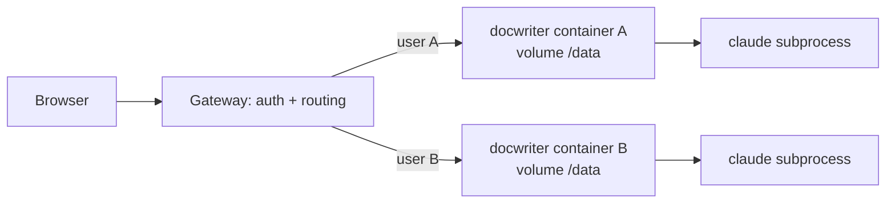

Read this page before starting a hosted deployment. It records why the earlier multi-tenant attempt (PR #51, closed) was abandoned and the approach to use instead.

## The constraint

DocWriter is a single-tenant process by design. One process owns one workspace root, one SQLite file, one Hocuspocus server, and one agent session:

- `DOCWRITER_ROOT` is read once at module load (`document-files.ts`, `workspace-path.ts`) and every path helper builds on that constant.
- `getDb()` is a process-wide singleton, and `globalThis.__docwriterWsServer` is the one live document server.
- The agent is a real `claude` subprocess with `cwd` set to the workspace root. It reads the workspace with the built-in Read, Glob, Grep, and Bash tools, which make ordinary filesystem calls. User hooks run shell commands the same way.
- Provider credentials come from the process environment and `~/.claude`.

This is why a "mock filesystem" does not fit. The editor's own file access could be virtualized, but the agent's cannot: the SDK spawns a separate process that expects real files. The only way to give it a virtual filesystem is to copy files out to a sandbox, run, and copy them back, which is the sandboxed runner PR #51 had to build.

## What PR #51 tried

PR #51 retrofitted tenancy into the single process. Every request ran inside an `AsyncLocalStorage` user scope, every server module resolved the user's root and database through that scope, `~/.claude` state was relocated per user, and agent Bash calls shipped a bundle of workspace files (up to 16 MB) to a remote runner app and merged the results back.

The cost was 71 changed files and about 13k added lines, most of them touching the modules that change every week. The branch fell 215 commits behind `main` and could not be merged. Any design that makes the server tenant-aware has this property: tenancy becomes a cross-cutting concern, and every future change on `main` has to be tenant-aware too.

## The approach to use: one container per workspace

Keep the app single-tenant and put the multi-tenancy outside it. Each user (or each workspace) gets their own container running the same build the CLI ships, with its own persistent volume mounted at the workspace root. This is how code-server, JupyterHub, Coder, and Gitpod host a single-user tool for many users.

What this buys:

- **No app changes for tenancy.** The container runs `docwriter --root /data --host --no-open` with an API key in the environment. `main` and the hosted build are the same code.
- **The container is the sandbox.** Agent Bash, user hooks, and scratch files stay inside the user's own container. No remote runner, no file bundling.
- **Isolation for free.** One user's SQLite, Yjs log, provider session, and `~/.claude` state cannot touch another's.
- **Idle cost is storage.** Machines stop when the WebSocket has been closed for a while and start on the next request.

## Recommended stack

Fly.io fits because it treats a machine per user as a first-class pattern and PR #51 already targeted it.

1. **Image.** A `Dockerfile` that builds the app with adapter-node and installs the Claude CLI. PR #51's `Dockerfile` and `.dockerignore` are a good starting point once the multi-tenant environment variables are removed.
2. **Single port.** Fly routes one port per machine, so the Hocuspocus WebSocket must share the HTTP port. Add an environment flag that makes `createWsServer` skip binding its own port and expose an upgrade handler that a small production entry point wires to `/ws`. PR #51's `server.js` shows the shape (about 30 lines). The client's WebSocket URL must then derive from the page origin instead of a fixed port.
3. **Health check.** A `GET /api/health` route returning 200 so the platform can tell a live machine from a booting one.
4. **Per-user machine and volume.** A gateway creates a Fly Machine and a volume the first time a user signs in and stores the mapping in its own small database. It reuses them on later visits.
5. **Routing.** The gateway authenticates the user, then answers with a `fly-replay: instance=<machine-id>` header so Fly's proxy forwards the request, WebSocket included, to that machine. The container itself listens only on the private network and checks a shared secret header so it cannot be reached except through the gateway.
6. **Auth.** Clerk on the gateway only. The app never sees Clerk; PR #51's sign-in page can be reused there.
7. **Deploys.** Rebuilding the image and updating each machine's image is the whole deploy. Users' volumes are untouched.

Keep the landing site on Vercel as it is now. The `landing` branch and its sync workflow are unrelated to the hosted editor and stay as they are.

## Smallest version for a user study

If the immediate need is a study with a known set of participants, skip the gateway:

- Create one Fly app per participant (or one app with one machine per participant), each with its own volume and API key.
- Give each participant a URL with a long random token; the container rejects requests without it.
- Stop and delete the machines when the study ends.

This needs only steps 1 to 3 above and ships in a day. The gateway and Clerk come later, and nothing built for the study is thrown away when they do.

## What to carry over from PR #51

Reuse: `Dockerfile`, `.dockerignore`, `server.js` (single-port entry point), the `/api/health` route, the `SINGLE_PORT_WS` change in `ws-server.ts`, and the Clerk sign-in page for the gateway.

Do not reuse: `request-context.ts`, `workspace.ts`, per-user database caching, `hosted-runner.ts` and the `runner/` app, the hosted model and API-key restrictions, and every `isMultiTenant()` branch in server modules.
