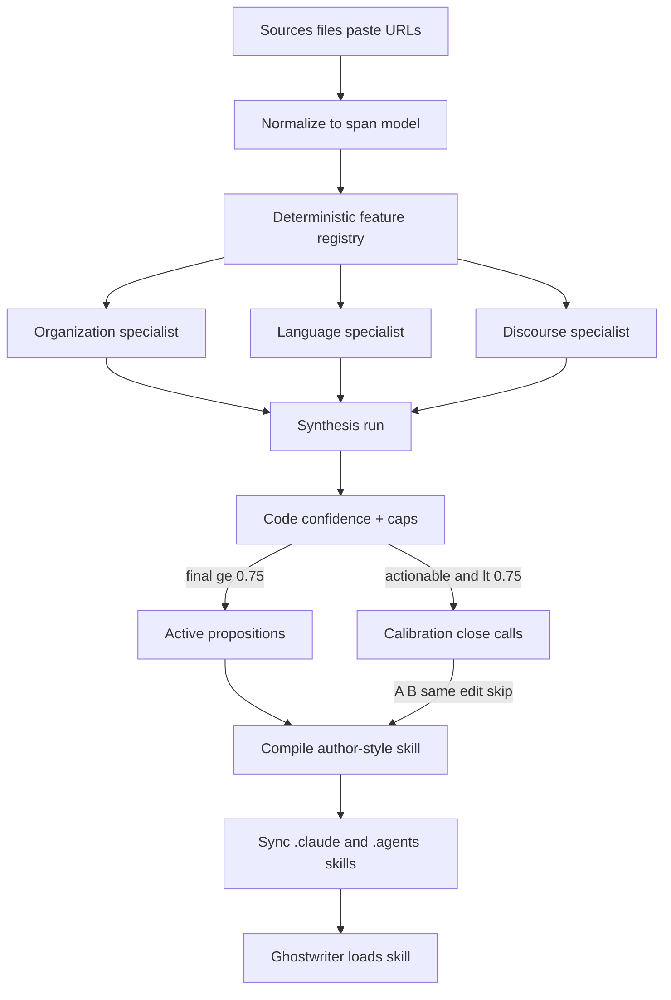

---
todos:
  - id: schema-types
    status: completed
    content: 'Add Zod schemas + TS types; persist StyleProposition/metrics inside skills/author-style/, not parallel style-profile.json'
  - id: materialize-normalize
    status: completed
    content: Implement source materialization (files/paste/URL) and span-preserving normalize into NormalizedDocument
  - id: feature-registry
    status: completed
    content: 'Feature registry incl. punctuation + distinctive-lexicon extractor (signature words/phrases, AI-ism absences); confidence.ts'
  - id: specialists-tools
    status: completed
    content: Specialist/synthesis tools; language specialist prompted hard on unusual word choice using lexicon metrics; provider-neutral mounting
  - id: calibration
    status: completed
    content: 'Close-call generation, validators, response handling (A/B/same/edit/skip), max 8 first session'
  - id: compile-skill
    status: completed
    content: 'Compile author-style Agent Skill (SKILL.md body with active rules), zip bundle, sync via skills-config with collision-safe ID'
  - id: api-routes
    status: completed
    content: Add style-profile APIs + extend references API for role/materialization; stop raw-ref auto-submit on add
  - id: ui-header-modal
    status: completed
    content: Header control after ModelPicker + four-step modal; wire Settings entry; render prefers skill over raw refs
  - id: tests
    status: completed
    content: Vitest + Playwright; gold fixtures from 5 Shreya sources (3 blogs + EvalGen + DocETL) with fetch script and metric/skill smoke
name: Author Style Skill
overview: 'Build a structured reference analysis pipeline that compiles into a portable Agent Skill (`author-style`) loaded by DocWriter’s ghostwriter via the existing skills system. Internal proposition schemas power measurement, calibration, and compile; the user-facing deliverable is a real SKILL.md of imperative writing rules with short examples.'
isProject: false
---
# Structured References → Portable Author Style Skill

## Goal

Turn writing references into a **portable Agent Skill** that DocWriter’s ghostwriter loads like `plain-writing` / `hooks-creator`, and that the user can zip and take to Claude/Codex/etc.

Internal analysis stays structured. The skill body stays human-readable imperative guidance — not dumped JSON.

## Locked proposition schema

Internal model (Zod-validated, stored under `.docwriter/`). Designed so compile can emit plain-writing-style rules.

```ts
type PropositionStatus =
  | 'active'        // final ≥ 0.75, or user-confirmed
  | 'calibration'   // actionable but uncertain; excluded from skill
  | 'inactive'      // user disabled, or "both same"
  | 'skipped'       // skipped after "neither is good"
  | 'observation';  // report-only; never an instruction

interface EvidenceRef {
  sourceId: string;
  spanId: string;     // from NormalizedDocument
  quote: string;      // must equal span text
  role: 'authored' | 'inspiration';
}

interface StyleProposition {
  id: string;
  schemaVersion: 1;
  family: FeatureFamily;          // closed enum, 10 families
  type: PropositionType;          // closed enum per family (~35–45)
  instruction: string;            // imperative rule → SKILL.md body
  claim?: string;                 // optional descriptive summary for UI
  scope: {
    genres?: string[];
    audiences?: string[];
    sections?: Array<'opening' | 'body' | 'closing' | string>;
    appliesWhen?: string;
  };
  metrics: Array<{ metricId: string; summary: string; value?: number | Record<string, number> }>;
  evidence: EvidenceRef[];
  counterevidence: EvidenceRef[];
  examples: Array<{ id: string; text: string; sourceId?: string; polarity: 'positive' }>;
  confidence: {
    evidence: number;
    agentInterpretation: number;
    extractorReliability: number;
    final: number;
  };
  origin: 'authored' | 'aspirational' | 'mixed';
  status: PropositionStatus;
  enabled: boolean;
  calibration?: { trialId: string; response: 'a' | 'b' | 'same' | 'edited' | 'skip'; chosenExampleId?: string };
  createdAt: number;
  updatedAt: number;
  sourceRunId: string;
}
```

**Decisions locked from your feedback:**

- Single imperative `instruction` (no `do`/`dont` slots). Matches how real skills work.
- Full closed `PropositionType` catalog across all 10 families in v1 (measurements for all; only actionable typed props become instructions).
- Rejected A/B text is never stored as anti-examples.
- Server rejects unknown metric IDs, invented spans/quotes, bad confidence, unsupported families.

**GUM parallel ([arXiv:2505.10831](https://arxiv.org/pdf/2505.10831)):** their unit is a free-form confidence-weighted NL proposition with grounding. Ours keeps that spirit (`claim` + `confidence` + `evidence`) but adds typed `family`/`type`/`metrics` so style can be measured, calibrated with close calls, and compiled into imperative skill rules. The ghostwriter consumes the compiled `SKILL.md`, not the JSON store.

## What the compiled skill looks like

Valid [Agent Skills](https://agentskills.io/specification) bundle, progressive disclosure:

```text
.docwriter/skills/author-style/
  SKILL.md                      # name+description + compiled active rules
  agents/openai.yaml            # display metadata for Codex/ChatGPT
  references/
    style-profile.md            # fuller profile if agent needs more
    metrics.json                # versioned deterministic measurements
    propositions.json           # active (+ optionally all) structured props
    examples.md                 # short grounded positive examples
    source-manifest.json        # roles + content hashes only (no raw text)
  scripts/
    analyze-style.mjs           # dependency-free ESM metric engine copy
```

**`SKILL.md` is not frontmatter-only.** Frontmatter triggers discovery; the body holds the executable guidance (like [`plain-writing/SKILL.md`](src/lib/server/skills/plain-writing/SKILL.md)):

```md
---
name: author-style
description: >
  Write and edit prose in this author's measured style. Use whenever drafting
  or revising documents for this workspace unless the user asks for a different voice.
---

# Author style

Apply these active preferences. Preserve meaning. Prefer style over inventing facts
from references. Ignore inactive or calibrating guidance.

## Sentences and rhythm
1. **Keep most sentences between 12 and 20 words**, with occasional short
   sentences for emphasis.
   Example: …

## Voice
2. **Prefer first person plural in methods and results.** …
```

Compile only `status === 'active' && enabled`. Cap body size (~active rules + one short example each); point to `references/` for metrics/detail. Bundle excludes raw sources and web cache.

Sync through existing [`skills-config.ts`](src/lib/server/skills-config.ts) into `.claude/skills` and `.agents/skills`. Managed skill id `author-style`; if a user-installed skill collides, use reserved fallback `docwriter-author-style` and never overwrite the user’s skill.

Once a skill is active, render stops dumping raw reference lists into the writing prompt (one nonblocking “add references” reminder per workspace session if none exist). References remain available inside the style modal for re-analysis.

## Architecture



## Integration points (existing code)

| Area | Current | Change |
|------|---------|--------|
| References | [`references.ts`](src/lib/server/references.ts) — `id/label/type/target/addedAt` | Extend with `role`, `format`, `contentHash`, materialization/cache/error fields; keep JSON index under `.docwriter/references.json` |
| Add-ref UX | [`ReferencesPanel.svelte`](src/lib/components/ReferencesPanel.svelte) auto-`onSubmit`s an edit prompt | Stop auto-waking the writing agent; open the shared style modal instead |
| Header | [`+page.svelte`](src/routes/+page.svelte) `header-left`: MenuBar → **ModelPicker** | Add persistent **References/Style** control immediately after ModelPicker |
| Skills | [`skills-config.ts`](src/lib/server/skills-config.ts) + boot sync in [`hooks.server.ts`](src/hooks.server.ts) | Add managed `author-style` sync after compile |
| Render | [`render/+server.ts`](src/routes/api/render/+server.ts) injects up to 6 refs | Prefer compiled skill; keep style-only contract; reminder if no refs |
| Provider tools | Claude MCP in [`claude.ts`](src/lib/server/providers/claude.ts); others in [`tool-handlers.ts`](src/lib/server/providers/tool-handlers.ts) | Shared typed specialist/synthesis tools for all providers (no doc edit / shell / general file tools on these runs) |

## Persistence — skill is enough (almost)

**Yes: the skill is the durable artifact.** Do not invent a parallel profile store.

```text
.docwriter/
  references.json              # already exists; extend with role, contentHash, etc.
  references/                  # already exists; samples + web extraction cache
  skills/author-style/         # THE style state + portable Agent Skill
    SKILL.md
    agents/openai.yaml
    references/
      propositions.json        # all props (active/calibration/inactive) + confidence
      metrics.json
      examples.md
      source-manifest.json     # hashes for staleness vs references.json
    scripts/analyze-style.mjs
  style-runs/<runId>/          # ephemeral only; delete on success or after cancel TTL
```

| Keep | Why |
|------|-----|
| `skills/author-style/` | Ghostwriter load target + zip download + user edits to props |
| `references.json` (+ cache) | Inputs; already in the product |
| `style-runs/<id>/` | In-flight specialist checkpoints / A/B drafts — not user-facing, not synced to `.claude` |

| Drop | Why |
|------|-----|
| `style-profile.json` | Duplicate of skill `references/propositions.json` + SKILL.md |
| `style-analysis/` as permanent tree | Use ephemeral `style-runs/` instead |
| `style-study/events.jsonl` | Out of scope for v1; calibration outcomes live on the propositions in the skill |

Staleness = compare `source-manifest.json` hashes to current reference content hashes. Header “N choices” = count of `status === 'calibration'` in `propositions.json`. Recompile SKILL.md after calibration/edits.

Schemas still exist in code (Zod) for validation; they persist inside the skill JSON, not as separate top-level files.

## API surface

Thin wrappers over the skill + runs (keep `/api/style-profile` names for the UI, but storage is the skill):

- `GET /api/style-profile` — read skill `propositions.json` + staleness + unresolved count
- `POST /api/style-profile/runs` — start analysis into ephemeral `style-runs/<id>/`
- `GET /api/style-profile/runs/[id]/events` — SSE progress
- `DELETE /api/style-profile/runs/[id]` — cancel; wipe or TTL the run dir
- `POST/PUT /api/style-profile/calibrations/[id]` — resolve close call → update skill props → recompile SKILL.md
- `GET /api/style-profile/bundle` — zip `.docwriter/skills/author-style/` (no raw sources)
- Extend existing `/api/references` for role, materialize/preview/refresh extraction

## UI

One modal, four steps (Sources → Analysis → Calibration → Active skill), opened from:

1. New header control after ModelPicker (`References not provided` / `Analyzing…` / `Style active` / `Style active · N choices` / `Update style` / stale / failed)
2. Existing Settings → Writing references entry

Calibration: at most 8 close calls first session; A / B / Both same / Neither (edit or skip). Code validates A/B before display; regenerate once on failure.

## Pipeline modules (new under `src/lib/server/style/`)

1. **`materialize.ts`** — workspace md/mdx/txt/tex/html/pdf, paste, URL (HTML/text/PDF) with fetch limits; cache + user-editable extracted text
2. **`normalize.ts`** — shared span-preserving `NormalizedDocument`
3. **`features/`** — typed feature registry; punctuation first-class; **distinctive lexicon** extractor (see below)
4. **`confidence.ts`** — evidence formula + caps (single-source ≤0.65, role conflict ≤0.70); activate ≥0.75
5. **`specialists.ts`** — 3 concurrent Agent SDK runs + synthesis; language specialist gets lexicon slice + explicit unusual-word-choice brief; typed submit tools; retry once; partial compile on specialist failure

### Distinctive lexicon (programmatic — yes, possible)

Under `vocabulary_register`, compute a **signature lexicon** from the authored refs (inspiration refs scored separately):

1. **Tokenize** content words (drop stopwords, URLs, citations, pure numbers, code-ish tokens).
2. **Cross-doc signature words:** lemmas/tokens that appear in ≥2 authored sources (or ≥K times with dispersion), ranked by a simple distinctiveness score:
   - `log(1 + count) * document_frequency` within the author’s set, minus a penalty if the word is in a small built-in **common-English / academic-boilerplate** list (the, however, furthermore, utilize, …).
   - No external corpus download required for v1 — use an embedded common-word list + optional AI-overuse list (`delve`, `tapestry`, `robust`, `leverage`, `landscape`, `pivotal`, …).
3. **AI-ism absences:** words on the AI-overuse list with ~zero rate in authored text → emit as “do not use” candidates (high value for ghostwriting).
4. **Preferred phrases / n-grams:** top bigrams/trigrams with df ≥ 2 after stopword filtering (e.g. “criteria drift”, “plain writing”).
5. **Surface stats still kept:** lexical diversity, syllable/word length, contraction rate, nominalization signals, discourse markers.

Emit into metrics as e.g. `lexicon.signature_words[]`, `lexicon.signature_phrases[]`, `lexicon.ai_isms_absent[]`, each with counts, df, example span IDs. These feed the language specialist and can compile directly into skill rules like “Prefer X; never write delve/tapestry/…”.

### Language specialist brief (agent)

Prompt must make word choice a primary job, not an afterthought:

- Treat the signature lexicon lists as **evidence to interpret**, not invent — every unusual-word claim must cite metric IDs + span quotes.
- Prioritize: (a) unusual or characteristic word/phrase choices, (b) words/phrases the author never uses that models overuse, (c) register/formality quirks, (d) only then generic “varied vocabulary” fluff.
- Prefer concrete instructions (“Say ‘assertion’ not ‘guardrail’ when you mean executable checks”) over vague ones (“use sophisticated diction”).
- Counterevidence required when a signature word is domain-only (paper jargon) vs voice.
6. **`calibrate.ts`** — close-call generation + validation + response handling
7. **`compile-skill.ts`** — write skill tree, validate frontmatter, sync managed skill
8. **`analyze-style.mjs`** — dependency-free ESM shared by server import and bundle copy

## Evaluation inspiration (not a full study build)

Cite [Creating General User Models from Computer Use](https://arxiv.org/pdf/2505.10831) (Shaikh et al., UIST ’25 / arXiv:2505.10831) as the methodological reference for *how* to judge propositions — not as a system to reproduce.

**Borrow from GUM §6 (accuracy + calibration):**

- Confidence-weighted propositions with explicit grounding
- Participant binary accuracy on stratified confidence bands (high / mid / low)
- Pairwise condition comparisons that allow ties
- Prefer underconfidence over overconfidence (activate only when `final ≥ 0.75`; uncertain props stay out of the skill until calibration)
- Users can inspect, edit, disable, or delete propositions (GUM “Memory” page pattern → our Active skill step)

**Do not build in this PR:**

- GUM-style email/screenshot observers or continuous revise/retrieve loop
- Full ablation study (No Retrieve / No Revise) or Brier reporting UI
- N=18 / N=5 participant protocols, Holm-corrected significance, bootstrap CI dashboards
- Latin-square multi-condition editing study, held-out blind passage comparisons
- Topic-leakage harness, telemetry upload

**No separate study log in v1.** Calibration outcomes update propositions inside the skill; that is enough to inspect later if we add a pilot.

## Out of scope for this PR

- Multi-participant study execution or analysis tooling
- Topic-leakage evaluation harness
- Telemetry upload
- SQLite migration

## Validation

### Unit / synthetic

- Vitest for server modules (`npm run test:unit`): extraction fixtures, punctuation spans/false positives, confidence caps, specialist submission rejection, calibration responses, skill compile (no raw source leakage), managed-skill collision
- Playwright smoke for header states + modal happy path
- `npm run check` and `npm run build`

### Gold corpus: Shreya Shankar writing (5 sources)

First-pass quality will be judged against real authored prose, not toy lorem. Fixture set (role = `authored`):

| # | Source | Why |
|---|--------|-----|
| 1 | [Writing in the Age of LLMs](https://www.sh-reya.com/blog/ai-writing/) | Personal blog voice on writing itself |
| 2 | [In Defense of AI Evals](https://www.sh-reya.com/blog/in-defense-ai-evals/) | Argumentative blog cadence |
| 3 | [Data Flywheels for LLM Applications](https://www.sh-reya.com/blog/ai-engineering-flywheel/) | Longer technical blog |
| 4 | [Who Validates the Validators?](https://arxiv.org/pdf/2404.12272) (EvalGen, UIST ’24) | Academic paper voice |
| 5 | [DocETL](https://arxiv.org/pdf/2410.12189) (VLDB ’25) | Systems paper voice |

Implementation notes:

- Script `scripts/fetch-style-fixtures.mjs` downloads HTML/PDF, runs the same materialize/normalize path, and writes extracted text under `fixtures/style/shreya/` (text only in git; raw PDFs gitignored or re-fetched).
- Vitest: deterministic metrics on the extracted fixtures (sentence length, punctuation, hedges/contractions, citation density blog vs paper) **plus** signature-word extraction (e.g. AI-isms absent from Shreya blogs; recurring phrases like criteria-related terms from EvalGen).
- Live/manual smoke (needs API key): full analysis → skill must include concrete word-choice rules, not only rhythm/structure. Expect first pass to miss; iterate lexicon + specialist prompts against this corpus before calling done.
- Do not treat blog vs paper genre collapse as a bug without scope tags — propositions should scope when distributions diverge.
