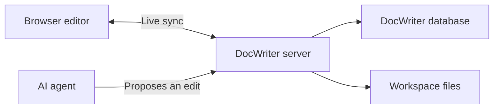

DocWriter keeps one live document for each open text tab. Your browser and the agent connect to the same server, so you can keep typing while the agent works.

## While you type

The browser sends each text change to the DocWriter server. The server saves the change in `.docwriter/docwriter.db` and writes the current plain text to the workspace file.

The database also stores comments, pending reviews, open tabs, rules, sessions, and interface settings. The workspace file contains only the text, so it works with Git and other editors.

## When the agent proposes an edit

The agent saves a proposed change as review data. The committed document text does not change yet. The editor shows the proposed text as a diff so you can compare it with the current text.

Accepting the proposal changes the document and removes the pending review. Rejecting the proposal removes the review without changing the document.

## After a restart

DocWriter rebuilds each tab from the saved database updates. If a workspace file changed outside DocWriter and is newer, DocWriter can load that file instead.

Run DocWriter with `--watch` when another program will edit workspace files while DocWriter is open.

## What to back up

Back up the workspace files for the document text. Back up `.docwriter/docwriter.db` when you also need comments, pending reviews, sessions, and interface state.

Read [Storage and backups](/help/storage-and-backups) for backup and restore steps. Contributors can read [Architecture](/contribute/architecture) for the code paths and transaction details.
