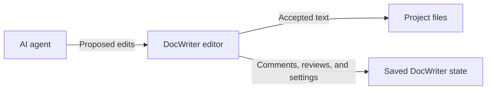

DocWriter saves accepted text in your project files. It saves comments, pending reviews, sessions, and settings in `.docwriter/docwriter.db`. You need both when a backup should preserve the full workspace.

## While you type

DocWriter saves changes as you type and writes the current accepted text to the project file after a short delay. Project files contain plain text that Git and other editors can read. Comments, pending reviews, open tabs, rules, sessions, and interface settings stay in saved DocWriter state.

If DocWriter crashes, restart it and check the end of the document. The last text entered before the crash may not have finished saving.

## When the agent proposes an edit

The agent saves a requested change as a pending review. The accepted text in the project file does not change yet. The editor shows a diff, which marks the text that the proposal would add and remove.

Accepting the proposal changes the affected document text and removes the pending review. DocWriter checks that the old text still matches before it applies the edit, which protects newer typing from a stale proposal. Accepting also marks text introduced by the agent as AI provenance. AI provenance is saved information about which text the agent wrote.

Rejecting the proposal removes the pending review without changing the accepted document text. Starting a new session also rejects pending proposals. Copy proposal text first if you may need it later.

## After a restart

DocWriter reopens each tab from saved DocWriter state when it is available. Otherwise, it starts from the text in the project file.

If another program changes a project file, DocWriter may use that newer text when you reload. Replacing the saved version also removes comments, pending reviews, and AI authorship markers attached to the previous version. Reloading also clears the browser undo history.

Run DocWriter with `--watch` when another program will edit workspace files while DocWriter is open. Watch mode reloads the browser after supported files change. Finish or copy pending review work before an external file replaces saved tab state.

## What to back up

Back up the project files when you need the accepted document text. Also back up `.docwriter/docwriter.db` when you need comments, pending reviews, sessions, rules, reviewers, and interface settings.

Stop DocWriter before copying or restoring `docwriter.db` so the file does not change during the copy. Restoring an older project file or `docwriter.db` removes newer work at the destination, so save that newer work elsewhere first.

Read [Storage and backups](/help/storage-and-backups) for backup and restore steps. Contributors can read [Architecture](/contribute/architecture) for the storage design and code paths.
