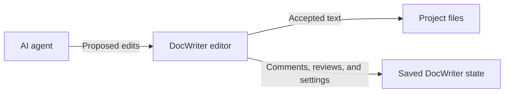

Your accepted text lives in your project files. Comments, pending reviews, sessions, and settings live in `.docwriter/docwriter.db`. Back up both when you want to preserve the full workspace.

## While you type

As you type, DocWriter saves your changes continuously. DocWriter writes the current accepted text to the project file after a short delay. Project files contain plain text that Git and other editors can read. Comments, pending reviews, open tabs, rules, sessions, and interface settings stay in saved DocWriter state.

If DocWriter crashes, restart it and check the end of the document. The last text entered before the crash may not have finished saving.

## When the agent proposes an edit

When the agent proposes an edit, your accepted text in the project file stays unchanged until you accept. You will see a diff that marks the text the proposal would add and remove.

When you accept the proposal, the affected document text updates and the pending review disappears. DocWriter checks that the old text still matches before it applies the edit, which protects newer typing from a stale proposal. Accepting also marks text introduced by the agent as AI provenance. AI provenance is saved information about which text the agent wrote.

When you reject the proposal, the pending review disappears and your accepted document text stays the same. Starting a new session also rejects pending proposals. Copy proposal text first if you may need it later.

## After a restart

After a restart, you will see each tab restored from saved DocWriter state when it is available. Otherwise, DocWriter opens the text from the project file.

If another program changes a project file, you may see that newer text when you reload. If the newer file replaces what you had open, you lose comments, pending reviews, and AI authorship markers attached to the previous version. Reloading also clears your browser undo history.

Run DocWriter with `--watch` when another program will edit workspace files while DocWriter is open. Watch mode reloads the browser after supported files change. Finish or copy pending review work before an external file replaces saved tab state.

## What to back up

Back up the project files when you need the accepted document text. Also back up `.docwriter/docwriter.db` when you need comments, pending reviews, sessions, rules, reviewers, and interface settings.

Stop DocWriter before you copy or restore `docwriter.db` so the file does not change during the copy. Restoring an older project file or `docwriter.db` removes newer work at the destination, so save that newer work elsewhere first.

Read [Storage and backups](/help/storage-and-backups) for backup and restore steps. Contributors can read [Architecture](/contribute/architecture) for the storage design and code paths.
